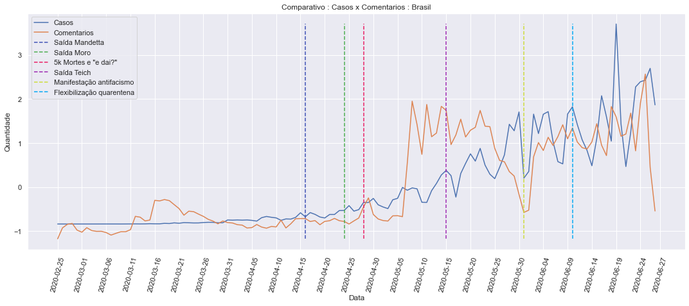
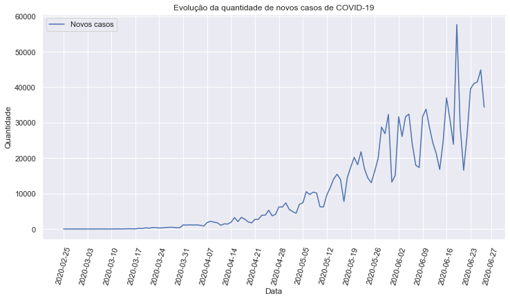

> Projeto final para a disciplina **Ciência e Visualização de Dados em Saúde** (IA386X) ministrada pelo **prof. André Santanchè** (IC) e **prof. Paula Dornhofer Paro Costa** (FEEC).


# Análise da Disseminação de COVID-19 a partir de redes sociais

## Analysis of the Dissemination of COVID-19 from social networks

## Descrição

O uso das redes sociais no últimos anos efetivamente se espalhou na sociedade moderna, permitindo que diversas pessoas possam ter voz e expressar seus sentimentos. Tendo em vista a quantidade de informações disponíveis nas redes sociais e a atual crise sanitária causada pela pandemia do novo Coronavírus, descoberto na China no começo de 2020, levanta-se a possibilidade de que um aumento na quantidade de comentários nas redes sociais (em especial no Twitter), relacionados à doença, esteja vinculado a um aumento na quantidade de casos confirmados de COVID-19.

Para realizar tal análise, foi realizada a coleta dos comentários de usuários da rede social Twitter. A partir desta coleta, realizou-se a classificação destes comentários, para só então observar, através de validações estatísticas, se existe alguma "causalidade" inerente ou relação entre o aumento de usuários comunicando que estão doentes (ou que possuem sintomas da doença), com um aumento nos casos reportados oficialmente.

Os resultados apresentados não permitem uma inferência direta de tal relação entre os comentários e os casos, tendo em vista o período estudado e os dados utilizados.

## Abstract

The use of social networks in recent years has effectively spread in modern society, allowing a diversity of people to have a voice and express their feelings. Given the amount of information available on social networks and the current health crisis caused by the new Coronavirus pandemic, discovered in China in early 2020, the idea of linking an increase in the amount of comments on social networks (especially on Twitter) with the increase in the number of confirmed cases of COVID-19 arises.

In order to carry out such analysis, it was necessary to collect the comments of Twitter users. All those comments were processed and labeled, making possible to observe, through statistical validations, if there is any inherent "causality" or relationship between the increase in users reporting that they are sick (or have symptoms of the disease), with an increase in officially reported cases.

The final results do not allow a direct inference of such relationship between the comments and the cases, given the period studied and the data used.

## Equipe

 - [Iliana Burguán Valverde](https://github.com/imburguan) - 163677
 - [Rodolfo de Nadai](https://github.com/rdenadai) - 208911
 - [Victor Leal de Almeida](https://github.com/victorleal) - 104283
 - [Sabrina Beck Angelini](https://github.com/sabrina-beck)


## Vídeo

 - [Link do video](https://www.youtube.com/watch?v=qRRtS3g1nGw&fbclid=IwAR3IJ0us0Y9PeuHyP7r9ccZVtphJWtxnmV6k9Dd1CXbi2ECWfd9wirct1rE)


## Introdução e Motivação

As redes sociais exercem um papel fundamental na sociedade hoje, e é principalmente através delas que as pessoas se informam e discutem sobre notícias. Estudo conduzido com alunos de graduação (Social Media as Information Source: Undergraduates Use and Evaluation Behavior[[1]](https://asistdl.onlinelibrary.wiley.com/doi/full/10.1002/meet.2011.14504801283)) mostrou que 97% dos entrevistados usa as redes sociais como fonte de informação.

É também nas redes sociais que as pessoas compartilham informações sobre seu cotidiano. É fácil encontrar comentários sobre o trânsito, problemas no trabalho, dificuldades em alguma tarefa, sintomas de alguma doença. E é especialmente neste último item que está o objeto deste trabalho.

Com o avanço da COVID-19 no mundo (e consequentemente com sua rápida proliferação), várias análises sobre a doença surgem a cada momento. Estas análises vão desde a simples contagem dos casos e óbitos até previsões do aumento nestes números. Como exposto, as pessoas possuem uma tendência a expor nas redes sociais comentários diversos sobre seu cotidiano e possivelmente sobre seu estado de saúde. Dada a atual situação mundial de pandemia de COVID-19, presume-se que comentários relacionados aos principais sintomas de COVID-19 apareçam com maior frequência nas redes sociais.

Tendo em vista essa maior interação das redes sociais e a exposição cada maior de informações dos usuários, questiona-se a existência de uma relação entre o número de casos de COVID-19 efetivamente identificado pelas autoridades em saúde do Brasil, com os comentários feitos na rede social Twitter.

Este trabalho se inspira em outras tentativas de analisar comentários realizados em redes sociais e eventuais epidemias, especialmente as de Gripe. Um dos trabalhos mais conhecidos nesse sentido é o realizado pela Google, que criou a plataforma *Google Flu Trends*[[2]](https://www.google.org/flutrends/about/), cujo objetivo era prever o número de casos de Gripe nos Estados Unidos com base nas pesquisas com termos relacionados a Gripe, realizadas pelos usuários. Há de se observar que essa plataforma, entretanto, não foi capaz de fazer as previsões corretamente, por diversos motivos[[3]](https://science.sciencemag.org/content/343/6176/1203.full), e acabou sendo desativada pela empresa.

Este trabalho está organizado na seguinte forma:
1. Objetivo: elicita o objetivo da análise realizada sobre os comentários relacionados à COVID-19;
2. Recursos e métodos: elenca as bases de dados e as ferramentas utilizadas;
3. Metodologia: detalha os métodos de classificação dos comentários, bem como as análises estatísticas realizadas;
4. Resultados e discussão: apresenta os resultados encontrados com as análises estatísticas;
5. Conclusões: explicita as conclusões com bases nos resultados;
6. Trabalhos futuros: sugere novas análises e formas de tratar o problema em questão.


### Perguntas de Pesquisa

 - É possível identificar a disseminação da COVID-19 no Brasil, através do conteúdo de redes sociais?
 - Sendo possível, ou existindo alguma relação "causal":
   - Com que grau de certeza a disseminação de COVID-19 é identificada?
   - Com que antecedência podemos identificar a disseminação da doença (em dias/semanas)?
   - Considerando que boa parte do conteúdo extraído não terá informações de geolocalização, é possível verificar essa disseminação por cidades ou estados?


### 1. Objetivo

O projeto tem como principal objetivo avaliar a possibilidade de se identificar, através das redes sociais, a disseminação de doenças, especificamente a COVID-19 no Brasil.

A identificação baseia-se na extração e análise de comentários de usuários das redes sociais (mais especificamente do Twitter), que utilizaram termos relacionados aos sintomas da doenças, tais como “dor de cabeça”, “febre”, entre outros. O conteúdo desta extração, pré processado (usando técnicas de NLP - *Natural Language Processing*) e classificado como comentário positivo para a doença ou não (usando técnicas convencionais de ML - *Machine Learning*), será comparado com os dados oficiais de andamento da doença (quantidade de novos casos / mortes). Com isso, procura-se verificar a possibilidade de prever a disseminação da doença.

A análise leva em conta a evolução da quantidade de comentários e novos casos da doença ao longo do tempo, e dessa maneira foram inicialmente avaliados como séries temporais. Sendo os resultados concretos, isso forneceria informações sobre possíveis casos ainda não registrados oficialmente nas estatísticas elaboradas pelos órgãos oficiais, melhorando a visão de como a doença está disseminada na sociedade.

## 2. Recursos e Métodos

### Bases de Dados:
Para esta análise, foi criada uma base de dados com os comentários realizados no Twitter. Juntamente a esta base, foram utilizadas outras bases de dados sobre os casos de COVID-19 no Brasil inclusive as oficiais do Ministério da Saúde, entretanto, devido ao apagão de dados que ocorreram recentemente no Ministério, optou-se por não utilizar a mesma como base para as análises.

Base de Dados | Endereço na Web | Resumo descritivo e uso
----- | ----- | -----
Comentários Twitter | <não disponível online> | Base de dados com os comentários do Twitter, processados e classificados.
Comentários Positivos/Negativos | <não disponível online> | Dataset com comentários classificados como positivo / negativo para a doença ou sintomas dela.
Covid-19 : Dados Brasil[[4]](https://preprints.scielo.org/index.php/scielo/preprint/view/362/version/371) | https://github.com/wcota/covid19br | Informações sobre a evolução diária da COVID-19 no Brasil, com os números de casos e óbitos em todas as cidades
Covid-19 : Ministério da Saúde | https://covid.saude.gov.br/ | Informações oficiais sobre a evolução diária da COVID-19 no Brasil, com os números de casos e óbitos em todas as cidades

### Ferramentas
Ferramenta | Endereço na Web | Resumo descritivo e uso
----- | ----- | -----
Python | https://www.python.org/ | Linguagem de Programação Python, usada para os scripts de análise
SQLite | https://www.sqlite.org/index.html | Sistema Gerenciador de Banco de Dados simples, usado para armazenamento dos comentários do Twitter
Peewee | https://github.com/coleifer/peewee | ORM para a linguagem python que se conecta em diversas bases de dados, inclusive SQLite.
Scikit-Learn | https://scikit-learn.org/stable/ | Biblioteca com algoritmos de Machine Learning, utilizada na tarefa de classificação dos comentários
Statsmodels | https://www.statsmodels.org/stable/index.html | Biblioteca com modelos e testes estatísticos, utilizados nas análises estatísticas entre comentários e casos
Selenium WebDriver | https://www.selenium.dev/ | Biblioteca para automatização de tarefas em navegadores web. Utilizada para automação da coleta de comentários do Twitter
NTLK | https://www.nltk.org/ | Biblioteca com funções específicas para processamento de texto. Utilizada para classificação dos comentários

## 3. Metodologia
Como já especificado, o objetivo deste trabalho está em tentar correlacionar comentários relacionados à COVID-19 com o número de casos da doença no Brasil. Para tanto, faz-se necessária a coleta de tais comentários, o processamento destes comentários, de forma que sejam contabilizados, dentro do possível, apenas os comentários efetivamente relacionados a doença, e a posterior análise estatística com os dados oficiais sobre a COVID-19 no país.

Dado o alto número de comentários, optou-se pela classificação destes através de um algoritmo de *Machine Learning*. Feita esta classificação, o problema passou a ser tratado como uma série temporal: tanto o número de comentários como de casos variavam em função do tempo. Portanto, as análises foram feitas considerando essa especificidade.

### Detalhamento do Projeto
Nesta seção é detalhado todo o processo, desde a definição dos termos de pesquisa, classficação dos comentários e análises estatísticas.

#### Definição dos termos de busca
Para a coleta dos comentários do Twitter, havia a necessidade de se definir os termos para os quais seria feita a busca. A rede social possui um mecanismo de busca avançada que permite que apenas textos contendo tais termos sejam retornados. Por exemplo, pode-se definir a busca pelo termo "COVID" de forma que apenas comentários contendo "COVID" sejam retornados.

Para este trabalho, optou-se por, além dos termos que especificam a doença, utilizar termos de sintomas da doença, especificados pela Organização Mundial da Saúde[[5]](https://www.cdc.gov/coronavirus/2019-ncov/symptoms-testing/symptoms.html). A lista de termos utilizada é a seguinte:

||||
----- | ----- | -----
peguei covid, | peguei covid19, | peguei corona,
estou com covid, | estou com covid19, | estou com corona,
estou doente covid, | estou doente covid19, | estou doente corona,
dor de cabeça febre, | dor de cabeça corona, | dor de cabeça covid,
dor de cabeça covid19, | falta de ar corona, | falta de ar covid,
falta de ar covid19, | falta de ar, | dor de garganta corona,
dor de garganta covid, | dor de garganta covid19, | dor de garganta,
tosse, febre e coriza, | testei positivo covid, | testei positivo corona,
testei negativo covid, | testei negativo corona, | dor de cabeça febre,
dor de cabeça corona, | dor de cabeça covid, | dor de cabeça covid19,
diarréia corona, | diarréia covid, | diarréia covid19,
febre corona, | febre covid, | febre covid19,
falta de ar corona, | falta de ar covid, | falta de ar covid19,
tosse corona, | tosse covid, | tosse covid19,
coriza corona, | coriza covid, | coriza covid19,
dor de garganta corona, | dor de garganta covid, | dor de garganta covid19,
febre, | falta de ar, | tosse,
coriza, | dor de garganta, | tosse febre coriza

Optou-se ainda por restringir os resultados da busca a partir do dia 01/01/2020, de forma que apenas comentários feitos a partir desta data fossem coletados. Isso foi feito considerando que a doença teve maior conhecimento mundial no início de 2020.


#### Coleta dos comentários
A coleta dos comentários foi realizada de duas formas; a primeira, que permite a coleta mais ampla de comentários, visto que não há limitações impostas pela plataforma, foi utilizando a ferramenta Selenium WebDriver, que permite a abertura de um site (no caso o Twitter) e a "raspagem" das informações contidas na página. Para tanto, utilizou-se a URL de busca do Twitter `https://twitter.com/search?q=covid%20lang%3Apt&src=typed_query&f=live`. O parâmetro *q* da URL recebe o texto de acordo com o qual serão buscados os comentários.

A outra forma foi utilizando a API do Twitter, processo esse que possui limitações, como, por exemplo, o retorno de comentários de até 7 dias antes da data atual e a restrição na quantidade de requisições à API.

Usando ambas as formas foi possível coletar comentários do Twitter de acordo com as palavras chaves mencionadas no tópico anterior e gravá-los em uma base de dados do SQLite.

Considerando que um dos questionamentos do projeto é sobre a possibilidade da identificação dessa disseminação da doença usando geolocalização, foi coletada, ainda, a informação da cidade onde o usuário mora. Há de se observar, entretanto, que o usuário do Twitter tem a opção de não exibir essa informação, de forma que nem todos os comentários coletados possuem uma cidade associada. O procedimento de coleta dessa informação segue os mesmos métodos utilizados para coleta dos comentários.


#### Classificação dos comentários
Tendo em vista o grande volume de comentários coletados (ao todo foram coletados mais de 400 mil), optou-se pela classificação dos mesmos como **positivos** (aqueles comentários que efetivamente tem relação com a doença ou sintomas causados por ela) ou **negativos** (comentários que possuem as palavras-chaves mas que não possuem qualquer relevância com o estudo). Essa classificação segue a metodologia exposta em estudo sobre a classificação de comentários positivos/negativos relacionados com a disseminação da gripe, também usando o Twitter[[6]](https://ieeexplore.ieee.org/document/6424743)[[7]](https://dl.acm.org/doi/pdf/10.1145/1964858.1964874).

Esse processo de classifcação, também como exposto no estudo mencionado acima, faz uso de um classificador binário com um dataset de poucas centenas de comentários previamente rotulados. Portanto, dada essa demanda, a equipe se dispôs a criar um dataset com 2756 comentários classificados como positivo / negativo.

É importante citar que a rotulação feita pela equipe é trivial: o comentário é considerado positivo se apresentar o termo em questão (tosse, febre, etc) e apresentar uma mensagem que aparente estar relacionada com a existência de sintomas. Caso contrário, o comentário foi rotulado como negativo. Não houve validação por parte de um profissional de saúde.

Com o dataset terminado, foi realizada uma etapa de análise de alguns algoritmos de *Machine Learning* verificando quais dos possíveis seria viável utilizar para a classificação do conteúdo.

Para que os algoritmos de *Machine Learning* entendam frases ou palavras, é necessário transformar as mesmas em representações numéricas para que os algoritmos possam aprender padrões representativos. Dessa maneira, foram avaliadas duas formas de criação de variáveis latentes, a contagem de termos por frase e TF-IDF[[23]](https://0bc297c6-a-62cb3a1a-s-sites.googlegroups.com/site/caonmsu/ir/UsingTFIDFtoDetermineWordRelevanceinDocumentQueries.pdf?attachauth=ANoY7cqQ_C1xICCyXD-ppatj1CW6MlI4kIFWVFW7XtDmRGuCLYpaG-pN258QaZyQmjXg3LffiSL-j8TLUcqD5cGztwFTxytiIHB-dHGFok2Z-BljRZh2iEWlgdFFOFju23CASsJEw7AmBSfcw_rAwVirZYhiqxTYDeOXAIMnE_hfhRBbLpILDyuFPr8_R1AFPLtIGQ8Gn_keVH3vWyjkp3uLSpgQb0RaKblJHnNHHifRyDETwY7TRe1drr4oGVN9S5NZH09wEf617jB5tL7-gvs5oFvOpzuzjw%3D%3D&attredirects=0).  Para o pré-processamento foram realizadas algumas operações, como remoção de acentos e a stemização das palavras.

Preparadas as frases para a classificação, foram analisados quatro implementações do pacote scikit-learn (LogisticRegression[[24]](https://scikit-learn.org/stable/modules/generated/sklearn.linear_model.LogisticRegression.html), SGDClassifier[[25]](https://scikit-learn.org/stable/modules/generated/sklearn.linear_model.SGDClassifier.html?highlight=sgdclassifier#sklearn.linear_model.SGDClassifier), SVM com kernel linear e Radial Basis Function RBF[[26]](https://scikit-learn.org/stable/modules/svm.html#parameters-of-the-rbf-kernel)), para validar qual seria o melhor algoritmo a ser utilizado no projeto.

Com resultados bem próximos, qualquer um dos métodos poderia ser utilizado. Entretanto, no top 10 dos melhores, a grande maioria das posições foi ocupada pelo SVM (com ambos os kernel e variação nos parâmetros), portanto este algoritmo foi escolhido, juntamente com o TF-IDF para a geração do espaço latente.

Ao fim dessa etapa de avaliação e com a definição do algoritmo, foi realizada uma busca exaustiva para encontrar os melhores parâmetros tanto para o TF-IDF quanto para o SVM, tendo como resultado final os parâmetros abaixo:

```
--------------------
Train size : 80%
Test size  : 20%

--------------------
Best parameter (CV score=0.791):
{
  'tfidf__lowercase': False, 'tfidf__ngram_range': (1, 1),
  'svm__C': 15, 'svm__kernel': 'rbf',
  'svm__random_state': 0, 'svm__shrinking': True,
}

--------------------
Cross Validation accuracy: 0.79 (+/- 0.03)
[0.79118329 0.79814385 0.80974478 0.76798144 0.78886311]

--------------------
Classification Report
--------------------
              precision    recall  f1-score   support

           0       0.77      0.86      0.81       319
           1       0.75      0.62      0.68       220

    accuracy                           0.76       539
   macro avg       0.76      0.74      0.74       539
weighted avg       0.76      0.76      0.76       539
```


Por conseguinte, com o classificador treinado foi realizada a classificação de todos os comentários coletados na etapa anterior.

*Exemplos de comentários classificados*:

| Classificação | Comentário |
|-|-|
| positivo | Grupo nosso um tá tossindo a outra com febre e a maioria tá gripado vou abandonar esse povo kkkk |
| negativo | Em resposta a  @cangaceirinha Eu lembro de ti, Laís, fazendo isso KKKKKK |
| positivo | não aguento mais meus pais vindo ver que eu to com febre  minha testa ta ate oleosa 0:07 9,9 mil visualizações De  yuri. |
| positivo | Em resposta a  @mari_ferrarezi Tô me cuidando, miga. Ainda não tô com falta de ar, então acho que tá ok. Só tô tossindo muito e com gripe forte, mas essa época sempre fico assim. Em todo caso, tô evitando contato até com o povo daqui de casa |
| positivo | eu passo 80% do tempo doente, gripada, c dor de garganta etc, mas agora eu vou cismar q eh corona qodio |
| positivo | 2 dias praticamente sentindo febre emocional :( |
| positivo | Eu já acordei como? Com febre,dor de cabeça,e paranóica |
| negativo | Fala galera! Não peguei corona e nem to morto. Só dei um tempo pra estudar (as apostilas da foto) e adiantar umas coisas do Mestrado. Ai tive que dar um tempo pra colocar a vida em ordem. Desculpa o sumiço |
| negativo | Meus amigos: uma enfermeira lutando pra trabalhar sem se contaminar e um jovem que está com os sintomas e até falta de ar. Hahaha AAMMOOOOO A VONTADE DE VIVER DESSES JOVENS Citar Tweet Jônatas @jonatas_maia12  · 1 h Efeitos da quarentena |
| positivo | que falta de ar chata |

Abaixo, são apresentados alguns dados agregados existentes na base e suas porcentagens de acordo com os totais, assim como a nuvem de palavras (contendo as principais palavras) de todos os comentários.

```
Qtde. de Comentários                : 384281  100%
Qtde. de Comentários positivos      : 125135   33%
Qtde. de Comentários negativos      : 259146   67%
Qtde. de Comentários geolocalizados : 122268   32%
--------------------------------------------------
Qtde. de Usuários geolocalizados    : 88039   100%
Qtde. de Usuários em SP             : 17349    20%
Qtde. de Usuários em RJ             : 18145    21%
Qtde. de Usuários em MG             :  6289     7%
Qtde. de Usuários em BA             :  2289     3%
Qtde. de Usuários em AM             :  1759     2%
```

É importante observar que, dos comentários que possuíam geolocalização, a maioria deles vem dos estados de São Paulo e do Rio de Janeiro.


#### Análise temporal dos dados
Após a classificação dos comentários, e já considerando a variação dos casos de COVID-19 em função do tempo, evidenciou-se estarmos trabalhando com duas séries temporais. Sendo assim, as análises estatísticas foram realizadas com testes e algoritmos próprios para este tipo de dado.

Uma análise exploratória inicial mostra a evolução dos comentários positivos ao longo do tempo, como pode ser visto na figura abaixo:


É possível observar um aumento no número de comentários positivos logo no início do mês de Maio. Não foi possível determinar as causas desses aumentos, muito embora existam, a princípio, duas possibilidades: 1. A coleta de comentários foi limitada de alguma forma, e não alcançou comentários feitos há mais tempo; 2. Os comentários do Twitter passaram a ser feitos com maior intensidade a partir do início de Maio. Essas possibilidades serão mencionadas na seção Trabalhos Futuros.

Já a figura abaixo exibe o total de comentários classificados como positivos por estado. Os dois estados com mais comentários positivos são Rio de Janeiro e São Paulo, ambos com um alto número de casos da doença.


Após a normalização dos totais de comentários e de casos (a fim de evitar a disparidade entre as informações e trazê-los para uma base comum), obtivemos a imagem abaixo. Ela mostra a evolução no número de casos de COVID-19 e de comentários positivos, junto com alguns eventos que ocorreram, especialmente no âmbito político, desde o início da pandemia no Brasil. Observa-se uma leve relação entre o número de comentários e de casos, muito embora, como será demonstrado na seção Resultados, isso não signifique que haja de fato uma causalidade entre as variáveis.



Após essa análise inicial, iniciou-se a análise estatística entre as variáveis, de forma a determinar se havia uma causalidade entre o número de comentários positivos escritos no Twitter e o número de casos de COVID-19. Para tanto, optou-se, inicialmente, pelo Teste de Causalidade de Granger, que permite validar se duas séries temporais apresentam causalidade entre si.

É importante denotar que a causalidade de Granger é um conceito de causalidade baseado em predições. Isto é, se uma série A "Granger-causa" a série B, isso significa que valores passados da série A provavelmente contém informações que ajudam a melhor predizer a série B, do que apenas utilizar os valores passados da série B [[28]](https://www.jneurosci.org/content/35/8/3293).

Entretanto, como especificidade deste tipo de informação, o teste demandava que as séries temporais estivessem estacionárias [[19]](https://www.sciencedirect.com/science/article/pii/S0165176501004980#:~:text=1.,is%20or%20are%20non%2Dstationary.), isto é, que as propriedades estatísticas das séries **não variassem em função do tempo**. O gráfico abaixo demonstra o número de casos de COVID-19 ao longo dos dias e é possível ver que a média (uma propriedade estatística) varia conforme o tempo avança. Além disso, observam-se duas características de séries temporais não estacionárias: a sazonalidade e a tendência (neste caso, de aumento).



Para confirmar se as séries temporais são estacionárias ou não, existem diversos métodos, entre eles o teste de Dickey-Fuller Aumentado[[27]](https://arch.readthedocs.io/en/latest/unitroot/unitroot_examples.html#Augmented-Dickey-Fuller-Testing), que é um teste bem conhecido na literatura e amplamente utilizado. Este teste foi selecionado para verificar a estacionariedade das séries. Abaixo, o resultado do teste de Dickey-Fuller para a série de casos:

```
Augmented Dickey-Fuller Test:
------------------------------
Casos:
------------------------------
ADF Statistic: 2.494451
p-value: 0.999048
Critical Values:
 - 1%: -3.491
 - 5%: -2.888
 - 10%: -2.581
Is the time series stationary? False
```

Levando em consideração tal informação sobre as séries temporais, foi realizado um estudo para avaliar se existe a possibilidade de verificar causalidade de Granger em séries não-estacionárias. Um modelo estatísico no qual é possível realizar a previsão de uma série temporal levando em consideração outras séries não estacionárias é conhecido como **Vector Error Correction Models (VECM)** [[20]](https://www.hindawi.com/journals/ddns/2018/5350308/)[[21]](http://ijcf.ticaret.edu.tr/index.php/ijcf/article/view/22)[[22]](https://ideas.repec.org/p/ams/ndfwpp/14-09.html), e sua implementação dentro do pacote *statsmodels* possui funcionalidades para verificar causalidade de Granger e causalidade instantânea entre séries temporais. Entretanto, para o uso deste modelo é necessário que as séries testadas sejam cointegradas, ou seja, quando duas ou mais séries são integradas por uma mesma determinada ordem de integração (que é o número mínimo de diferenças [lags] para a série se tornar estacionária) e a combinação linear das séries é integrada por uma ordem menor que a calculada para todas as séries.

Para avaliar a cointegração das séries, existem dois testes pesquisados que são frequentemente utilizados: o teste de Engle-Granger e o teste de Johansen. O teste de Engle-Granger foi escolhido dada a existência de apenas duas séries temporais e a menor complexidade do teste.

Para realizar a validação de causalidade de Granger entre as séries, o fator de atraso (ou *lag*) entre elas deve ser levado em consideração. Com isso, foram realizadas validações com o fator de atraso variando entre 1 e 30 dias.

### Evolução do Projeto
Apos ser escolhido o nome do projeto foi percebida a necessidade de estabelecer passos desde início ao fin da implantação do projeto e foi dividido em três etapas como a figura a seguir.


**Primeira Etapa**
- [Definição dos termos iniciais de pesquisa de comentários](https://github.com/rdenadai/Covid19-Twitter-Tracker#defini%C3%A7%C3%A3o-dos-termos-de-busca)
- [Coleta dos comentários do twitter](https://github.com/rdenadai/Covid19-Twitter-Tracker#coleta-dos-coment%C3%A1rios)

A etapa inicial do projeto foi relativamente simples. Como já existiam diversas bases de dados com os números dos casos de COVID-19, bastou seguir a definição dos termos de busca dos comentários, que foram baseados na lista de sintomas disponibilizada pelo CDC (Centro de Controle e Prevenção de Doenças dos EUA) e realizar a coleta dos comentários.

**Segunda Etapa**
- [Definição do algoritmo para a classificação dos comentários](https://github.com/rdenadai/Covid19-Twitter-Tracker#classifica%C3%A7%C3%A3o-dos-coment%C3%A1rios)
- [Análise dos dados e comparação com informações de disseminação da doença](https://github.com/rdenadai/Covid19-Twitter-Tracker#an%C3%A1lise-temporal-dos-dados)

Esta segunda etapa demandou um grande esforço. A classificação dos comentários seguiu metodologias de aprendizagem de máquina que já eram conhecidas pela equipe. Entretanto, a análise dos dados evidenciou estar se tratando do estudo de séries temporais, o que demandou diversas pesquisas na internet e na literatura a fim de entender como tais análises devem ser realizadas, com diversos novos conceitos. Inclusive, não havia o entendimento inicial de que tal metodologia seria seguida, muito embora o dataset principal (casos de COVID-19) seja, em si, uma série temporal.

**Terceira Etapa**
- [Criação do relatório final/apresentação e disponibilização no GitHub.](https://github.com/rdenadai/Covid19-Twitter-Tracker#an%C3%A1lise-temporal-dos-dados)


## 4. Resultados e Discussão
Como primeira avaliação, conforme o objetivo deste trabalho, foi analisada a causalidade entre o número de comentários positivos no Twitter e o número de casos de COVID-19.

Na comparação de causalidade de Granger entre comentários positivos e novos casos da doença, passando pela etapa de validação de estacionariedade das séries, cointegração entre elas e por fim a análise do modelo VECM, foram obtidos os seguintes resultados:

```
Augmented Dickey-Fuller Test:
------------------------------
Comentarios:
------------------------------
ADF Statistic: -1.520519
p-value: 0.523337
Critical Values:
 - 1%: -3.489
 - 5%: -2.887
 - 10%: -2.580
Is the time series stationary? False
------------------------------
Casos:
------------------------------
ADF Statistic: 2.494451
p-value: 0.999048
Critical Values:
 - 1%: -3.491
 - 5%: -2.888
 - 10%: -2.581
Is the time series stationary? False


Engle-Granger Test:
------------------------------
Cointegration Statistic: -4.262600
p-value: 0.002926
Critical Values:
 - 1%: -3.988
 - 5%: -3.386
 - 10%: -3.079
Is time series cointegrate? True

Vector Error Correction Models (VECM):
------------------------------
Lag: 15
Trend: c
Cointegration: 0

Granger causality F-test.
H_0: Comentarios does not Granger-cause Casos.
Conclusion: reject H_0 at 5% significance level.
===============================================
Test statistic Critical value p-value     df
-----------------------------------------------
         4.332          1.713   0.000 (16, 146)
-----------------------------------------------

Instantaneous causality Wald-test.
H_0: Comentarios does not instantaneously cause Casos.
Conclusion: fail to reject H_0 at 5% significance level.
========================================
Test statistic Critical value p-value df
----------------------------------------
        0.5529          3.841   0.457  1
----------------------------------------
```

Como o modelo VECM pode fornecer também a predição futura da série temporal e não apenas verificar causalidade de Granger, aplicando o mesmo em ambas as séries obtem-se como retorno a seguinte previsão para os próximos 3 dias (no caso os dias 28, 29 e 30 de junho) com algum erro.


É importante citar que o teste de causalidade de Granger tem como hipótese nula o fato de que a série temporal A **não Granger-causa** a série temporal B. O teste exposto acima **rejeita a hipótese nula**, isto é, a série temporal de Comentários aparenta ter uma causalidade de Granger com a série temporal de Casos.

O teste acima foi executado primeiramente para o período total de comentários, isto é, a série começou junto ao primeiro dia de notificação de casos de COVID-19, 25/02/2020, até o dia 27/06/2020.

Porém, um recorte feito dos dados até o dia 10/05/2020 mostrou outro resultado: o teste de causalidade indicou que a hipótese nula **não devia ser rejeitada**, apontando que a série de comentários não Granger-causa a série de casos. Foi feita uma análise até o dia 10/05/2020 a fim de validar a rejeição à hipótese nula, uma vez que o número de comentários e de casos estão, até este período, relativamente próximos.

[Inserir teste e imagens para o período 25/02/2020 - 10/05/2020]

Essa divergência entre os resultados conduz a diversos questionamentos. Levantou-se o fato de que, conforme a pandemia foi avançando, os casos começaram a acontecer entre as pessoas que possuem acesso ao Twitter. Há ainda a possibilidade de que, por estarmos nas estações do Outono e do Inverno, sintomas respiratórios começaram a ser relatados como potenciais sintomas de COVID-19. Esses fatores poderiam estar gerando uma "Granger-causalidade" entre as séries temporais.

Apesar das divergências encontradas, foram feitas outras avaliações em relação aos dados. Como observado, existe um aumento considerável no número de comentários positivos a partir do mês de Maio. Dessa forma, foi feito um recorte em ambos os datasets, considerando as informações apenas a partir do dia 05/05/2020. A rejeição à hipótese nula se manteve, isto é, aparentemente há causalidade entre as séries, como pode ser visto abaixo:


```
Vector Error Correction Models (VECM):
------------------------------
Lag: 15
Trend: c
Cointegration: 2

Granger causality F-test.
H_0: Comentarios does not Granger-cause Casos.
Conclusion: reject H_0 at 5% significance level.
=============================================
Test statistic Critical value p-value    df
---------------------------------------------
     1.953e+04          5.844   0.000 (16, 4)
---------------------------------------------

Instantaneous causality Wald-test. H_0:
Comentarios does not instantaneously cause Casos.
Conclusion: fail to reject H_0 at 5% significance level.
========================================
Test statistic Critical value p-value df
----------------------------------------
        0.3615          3.841   0.548  1
----------------------------------------
```

Foram feitos também recortes por estado. Como os estados de São Paulo e do Rio de Janeiro são os estados de onde vem a maioria dos comentários relacionados a COVID-19, optou-se por realizar esse filtro no dataset. Aqui, obteve-se resultado igual ao da análise feita para todo o país, onde foi possível determinar relação de causalidade. Esta análise considerou o período parcial (de 05/05/2020 a 27/06/2020).


```
Vector Error Correction Models (VECM):
------------------------------
Lag: 15
Trend: c
Cointegration: 1

Granger causality F-test.
H_0: Comentarios does not Granger-cause Casos.
Conclusion: reject H_0 at 5% significance level.
=============================================
Test statistic Critical value p-value    df
---------------------------------------------
         110.7          5.844   0.000 (16, 4)
---------------------------------------------

Instantaneous causality Wald-test.
H_0: Comentarios does not instantaneously cause Casos.
Conclusion: fail to reject H_0 at 5% significance level.
========================================
Test statistic Critical value p-value df
----------------------------------------
        0.7372          3.841   0.391  1
----------------------------------------
```

## 5. Conclusões
A análise da comparação entre os comentários realizados em redes sociais e o número de casos de uma epidemia demanda estudos mais avançados e nos conduz a considerar relacionamentos que, em um primeiro instante, não estão claros.

Na primeira análise realizada, encontrou-se causalidade entre os comentários e os casos de COVID-19. Entretanto, com algumas observações, surgem possibilidades de recorte dos dados que demonstram o contrário, ou seja, que não há causalidade. Isso nos leva a entender que o contexto do tempo possui uma certa influência nos resultados, de forma que não é possível determinar a causalidade entre os comentários positivos do Twitter e os casos de COVID-19; esta afirmação pede uma análise ainda mais refinada. Pode-se, por exemplo, realizar um recorte socioeconômico dos casos de COVID-19, incluindo informações de acesso a Internet, e, dessa forma, talvez chegar a um resultado diferente.

Também foi possível concluir que análises estatísticas mais sofisticadas podem ser realizadas. Há ainda a questão sobre os comentários do Twitter, cuja classificação pode ser mais refinada, tendo como base um maior número de comentários rotulados previamente.

Com isso, conclui-se que um trabalho que analise dados de saúde pública deve sempre observar características que, em um primeiro momento, parecem não ter relação com as análises.

## 6. Trabalhos Futuros
A partir da conclusão deste trabalho, sugerem-se alguns trabalhos futuros:
- Realizar uma coleta de comentários mais refinada e bem distribuída. A atual coleta de comentários pode continuar sendo feita, enquanto durar a pandemia, e uma nova análise pode ser realizada futuramente;
- Realizar a classificação de comentários do Twitter com base em um maior número de comentários rotulados previamente, ou, ainda, a construção de um dataset de comentários classificados manualmente;
- Realizar recortes mais específicos nas análises entre os números de casos e de comentários positivos;
- Utilizar análises mais sofisticadas de séries temporais;
- Aplicar outros métodos para estacionariedade das séries temporais.

### Referências:
 - [1] [Social Media as Information Source: Undergraduates Use and Evaluation Behavior](https://asistdl.onlinelibrary.wiley.com/doi/full/10.1002/meet.2011.14504801283)
 - [2] [Google Flu Trends](https://www.google.org/flutrends/about/)
 - [3] [The Parable of Google Flu: Traps in Big Data Analysis](https://science.sciencemag.org/content/343/6176/1203.full)
 - [4] [Monitoring the number of COVID-19 cases and deaths in Brazil at municipal and federative units level](https://preprints.scielo.org/index.php/scielo/preprint/view/362/version/371)
 - [5] [Symptoms of Coronavirus](https://www.cdc.gov/coronavirus/2019-ncov/symptoms-testing/symptoms.html)
 - [6] [Prediction of Infectious Disease Spread Using Twitter: A Case of Influenza](https://ieeexplore.ieee.org/document/6424743)
 - [7] [Towards detecting influenza epidemics by analyzing Twitter messages](https://dl.acm.org/doi/pdf/10.1145/1964858.1964874)
 - [8] [Predicting Flu Trends using Twitter data](https://ieeexplore.ieee.org/abstract/document/5928903)
 - [9] [Forecasting Word Model: Twitter-based Influenza Surveillance and Prediction](https://www.aclweb.org/anthology/C16-1008.pdf)
 - [10] [Analysing Twitter and web queries for flu trend prediction](https://link.springer.com/article/10.1186/1742-4682-11-S1-S6)
 - [11] [Twitter Improves Seasonal Influenza Prediction](https://scitepress.org/papers/2012/37806/37806.pdf)
 - [12] [Real-time disease surveillance using Twitter data: demonstration on flu and cancer](https://dl.acm.org/doi/abs/10.1145/2487575.2487709)
 - [13] [Applying GIS and Machine Learning Methods to Twitter Data for Multiscale Surveillance of Influenza](https://www.ncbi.nlm.nih.gov/pmc/articles/PMC4959719/)
 - [14] [Mining Twitter data for influenza detection and surveillance](https://dl.acm.org/doi/abs/10.1145/2897683.2897693)
 - [15] [Defining Facets of Social Distancing during the COVID-19 Pandemic: Twitter Analysis](https://www.medrxiv.org/content/10.1101/2020.04.26.20080937v1)
 - [16] [Predicting crime using Twitter and kernel density estimation](https://www.sciencedirect.com/science/article/pii/S0167923614000268)
 - [17] [Opinion Mining on Twitter Data using Unsupervised Learning Technique](https://www.ijcaonline.org/archives/volume148/number12/unnisa-2016-ijca-911317.pdf)
 - [18] [On the limited memory BFGS method for large scale optimization](https://link.springer.com/article/10.1007/BF01589116)
 - [19] [On spurious Granger causality](https://www.sciencedirect.com/science/article/pii/S0165176501004980#:~:text=1.,is%20or%20are%20non%2Dstationary.)
 - [20] [VECM Model Analysis of Carbon Emissions, GDP, and International Crude Oil Prices](https://www.hindawi.com/journals/ddns/2018/5350308/)
 - [21] [Causality Relationship Between Import, Export and Growth Rate in Developing Countries](http://ijcf.ticaret.edu.tr/index.php/ijcf/article/view/22)
 - [22] [Identifying causal relationships in case of non-stationary time series](https://ideas.repec.org/p/ams/ndfwpp/14-09.html)
 - [23] [TF-IDF](https://0bc297c6-a-62cb3a1a-s-sites.googlegroups.com/site/caonmsu/ir/UsingTFIDFtoDetermineWordRelevanceinDocumentQueries.pdf?attachauth=ANoY7cqQ_C1xICCyXD-ppatj1CW6MlI4kIFWVFW7XtDmRGuCLYpaG-pN258QaZyQmjXg3LffiSL-j8TLUcqD5cGztwFTxytiIHB-dHGFok2Z-BljRZh2iEWlgdFFOFju23CASsJEw7AmBSfcw_rAwVirZYhiqxTYDeOXAIMnE_hfhRBbLpILDyuFPr8_R1AFPLtIGQ8Gn_keVH3vWyjkp3uLSpgQb0RaKblJHnNHHifRyDETwY7TRe1drr4oGVN9S5NZH09wEf617jB5tL7-gvs5oFvOpzuzjw%3D%3D&attredirects=0)
 - [24] [Sklearn linear_model LogisticRegression](https://scikit-learn.org/stable/modules/generated/sklearn.linear_model.LogisticRegression.html)
 - [25] [Sklearn linear_model SGDClassifier](https://scikit-learn.org/stable/modules/generated/sklearn.linear_model.SGDClassifier.html?highlight=sgdclassifier#sklearn.linear_model.SGDClassifier)
 - [26] [SVM com o kernel Radial Basis Function (RBF)](https://scikit-learn.org/stable/modules/svm.html#parameters-of-the-rbf-kernel)
 - [27] [Augmented Dickey-Fuller Testing](https://arch.readthedocs.io/en/latest/unitroot/unitroot_examples.html#Augmented-Dickey-Fuller-Testing)
 - [28] [Granger Causality Analysis in Neuroscience and Neuroimaging](https://www.jneurosci.org/content/35/8/3293)