## Informações da base de dados

    Qtde. de Comentários            : 323641
    Qtde. de Comentários positivos  : 130847
    Qtde. de Comentários negativos  : 192794
    ----------------------------------------
    Qtde. de Usuários geolocalizados: 64899
    Qtde. de Usuários em SP         : 12763
    Qtde. de Usuários em RJ         : 13513

Exemplos de comentários com suas classificações:

    positivo|todo mundo dormindo, e eu acordada morrendo de dor de cabeça e queimando de febre, q ótimo
    negativo|Em resposta a  @vivixmorena  e  @AiltonBenedito Pois é, eu tinha essa dúvida também! Viajei final de fevereiro e tive muita dor nas pernas e dor de garganta! Mas se foi, não sei se apareceria no teste! Também não achei informações do tempo! Mas acredito que os anticorpos fiquem protegendo mesmo não aparecendo
    negativo|Tenho quase certeza de que já peguei COVID-19 e me curei sozinho sem nem ir ao hospital
    positivo|acho q tô com febre k
    negativo|Em resposta a  @edrgtto amigo, não se preocupe! eu adoro quando alguém me mostra algo que eu ainda não conheço com empolgação.

## Nuvens de palavras

Nuvem de palavras de todos os comentários na base de dados.

Nuvens de palavras apenas de comentários classificados como positivos.

## Visualizações dos dados

## Verificação de Causalidade

Lembrando as perguntas as quais deseja-se responder sobre essa análise:

 - É possível identificar a disseminação da COVID-19 no Brasil, através do conteúdo de redes sociais?
 - Sendo possível:
  - Com que grau de certeza a disseminação de COVID-19 é identificada?
  - Com que antecedência podemos identificar a disseminação da doença (em dias/semanas)?
  - Considerando que boa parte do conteúdo extraído não terá informações de geolocalização, é possível verificar essa disseminação por cidades ou estados?
  
Neste sentido, será necessário validar as séries temporais da quantidade de comentários ao longo de determinado período e a de Novo Casos / Mortes ao longo da pandemia.

Para esta análise, foi definido alguns limites:

 - Será feito uma análise do período todo de coleta.
  - Com relação a análise do período todo, é importante notar que a quantidade de comentários no Twitter da um grande salto a partir do dia 05/05, dessa maneira, será realizada uma análise deste período em diante para verificar se existe alguma modificação na relação causal.
 - Como visto acima, será selecionado apenas a análise dos estados de São Paulo e Rio de Janeiro por possuirem maior quantidade de comentários.

Estima-se que exite cerca de 8 milhões e 280 mil usuários no Twitter, entretanto no Brasil, tem-se aproximadamente 212 milhões de habitantes. Visto essa discrepância na quantidade de pessoas, para uma análise mais direcionada, os dados serão estandardizados:

$z = \frac{(x - \mu)}{\sigma}$

Após isso, para a análise de série temporais leva em consideração alguns aspectos.

A análise deve levar em consideração se as séries são estacionárias ou não. Sendo ambas estacionárias pode-se usar o modelo VAR (Vector Autoregression), que através deste pode-se validar a causalidade de Granger e instantânea entre as séries, além da possibilidade de predição (forecast).

Caso ambas as séries não sejam estacionárias, é válida a verificação se as mesmas são cointegradas, e se forem utiliza-se o modelo VECM (Vector Error Correction Models) permitindo a mesma validação que a apresentada pelo modelo VAR.

Se mesmo assim, não for possível aplicar nenhum do dois modelos, uma outra tentativa é transformar as séries (removendo um pequeno atraso (1 dia)) para que se tornem estacionárias. Feito isso o modelo VAR pode ser aplicado.

Para a verificar se as séries são estacionárias, é possível usar o teste de Dickey-Fuller, que verifica se as séries possuem raiz unitária.

No caso da verificação para validar se as séries são cointegradas, utiliza-se o teste de Engle-Granger.

### Período Completo

Como primeira análise, será aplicado o mencionado acima, na série temporal toda desde o "começo" da pandemia.

#### Novos Casos x Comentários Positivos

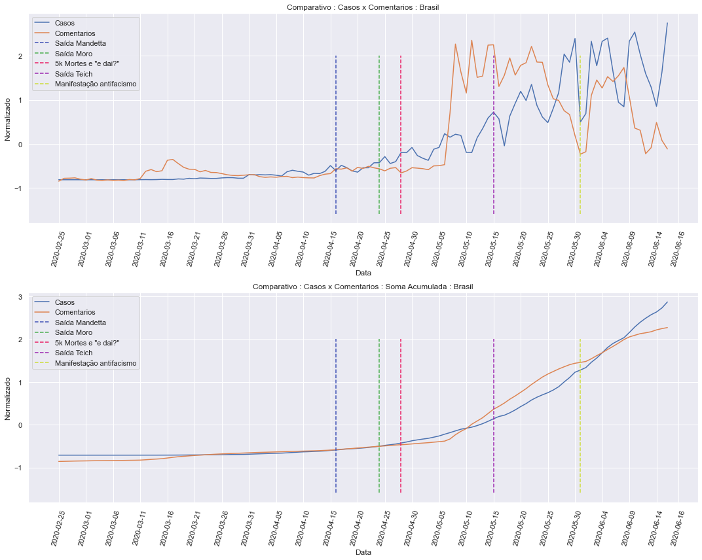

    Augmented Dickey-Fuller Test:
    ------------------------------
    
    Comentarios:
    ------------------------------
    ADF Statistic: -1.811971
    p-value: 0.374535
    Critical Values:
     - 1%: -3.491
     - 5%: -2.888
     - 10%: -2.581
    Is the time series stationary? False
    
    Casos:
    ------------------------------
    ADF Statistic: 0.327901
    p-value: 0.978589
    Critical Values:
     - 1%: -3.498
     - 5%: -2.891
     - 10%: -2.582
    Is the time series stationary? False
    
    
    Engle-Granger Test:
    ------------------------------
    
    ADF Statistic: -2.733106
    p-value: 0.053643
    Critical Values:
     - 1%: nan
     - 5%: nan
     - 10%: nan
    Is time series cointegrate? False
    
    !!! Can find a model that could fit the series, please make the series stationary !!!

Devido a ambas as séries não serem estacionárias, transforma-se ambas as séries removendo o atraso de 1 dia em ambas, tornando-as séries estacionárias.

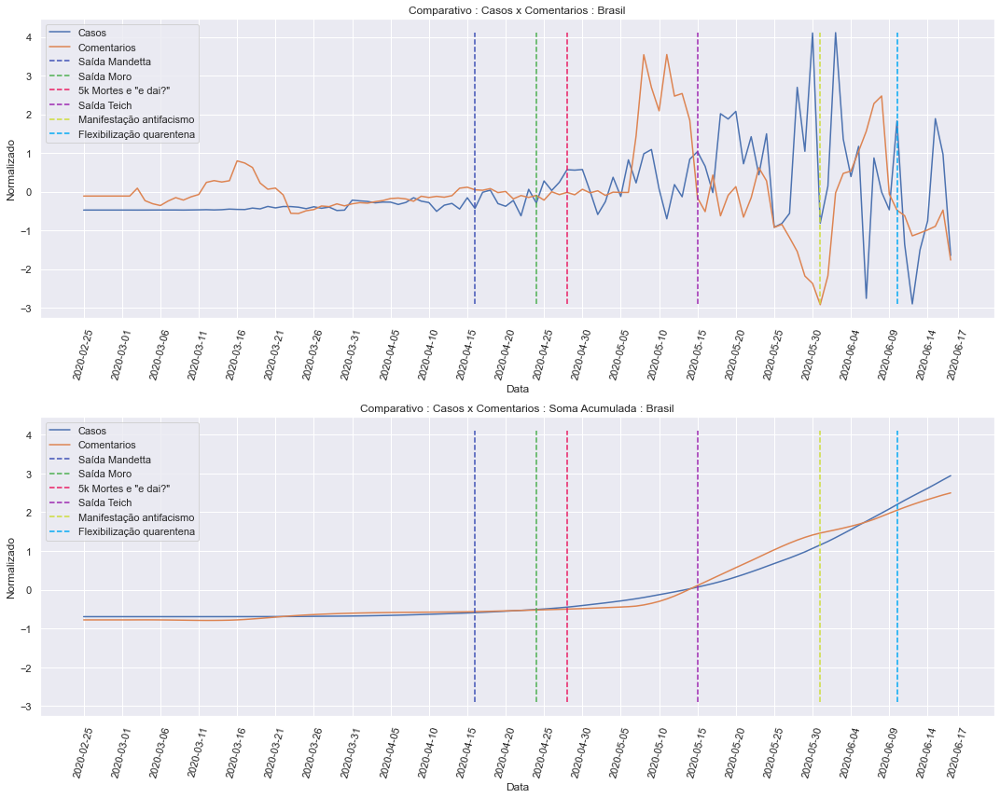

    Augmented Dickey-Fuller Test:
    ------------------------------
    
    Comentarios:
    ------------------------------
    ADF Statistic: -3.679712
    p-value: 0.004408
    Critical Values:
     - 1%: -3.498
     - 5%: -2.891
     - 10%: -2.582
    Is the time series stationary? True
    
    Casos:
    ------------------------------
    ADF Statistic: -1.558199
    p-value: 0.504550
    Critical Values:
     - 1%: -3.498
     - 5%: -2.891
     - 10%: -2.582
    Is the time series stationary? False
    
    
    Engle-Granger Test:
    ------------------------------
    
    ADF Statistic: -4.380892
    p-value: 0.000251
    Critical Values:
     - 1%: nan
     - 5%: nan
     - 10%: nan
    Is time series cointegrate? True
    
    !!! Can find a model that could fit the series, please make the series stationary !!!

#### Mortes x Comentários Positivos

Dando sequência as validações, faz-se a verificação se os comentários no Twitter possuem uma relação causal na quantidade de mortes que ocorrem.

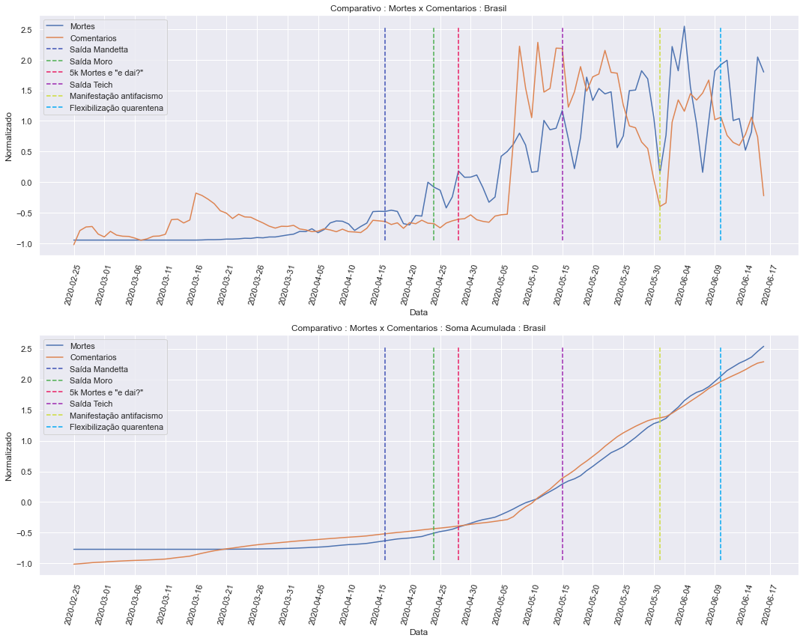

    Augmented Dickey-Fuller Test:
    ------------------------------
    
    Comentarios:
    ------------------------------
    ADF Statistic: -1.811971
    p-value: 0.374535
    Critical Values:
     - 1%: -3.491
     - 5%: -2.888
     - 10%: -2.581
    Is the time series stationary? False
    
    Mortes:
    ------------------------------
    ADF Statistic: 0.318702
    p-value: 0.978186
    Critical Values:
     - 1%: -3.498
     - 5%: -2.891
     - 10%: -2.582
    Is the time series stationary? False
    
    
    Engle-Granger Test:
    ------------------------------
    
    ADF Statistic: -3.628822
    p-value: 0.004020
    Critical Values:
     - 1%: nan
     - 5%: nan
     - 10%: nan
    Is time series cointegrate? True
    
    Vector Error Correction Models (VECM):
    ------------------------------
    Lag orders: {'aic': 1, 'bic': 0, 'hqic': 0, 'fpe': 1}
    
    Granger causality F-test. H_0: Comentarios does not Granger-cause Mortes. Conclusion: reject H_0 at 5% significance level.
    ==============================================
    Test statistic Critical value p-value    df   
    ----------------------------------------------
             8.662          3.039   0.000 (2, 210)
    ----------------------------------------------
    
    
    Instantaneous causality Wald-test. H_0: Comentarios does not instantaneously cause Mortes. Conclusion: fail to reject H_0 at 5% significance level.
    ========================================
    Test statistic Critical value p-value df
    ----------------------------------------
             2.051          3.841   0.152  1
    ----------------------------------------

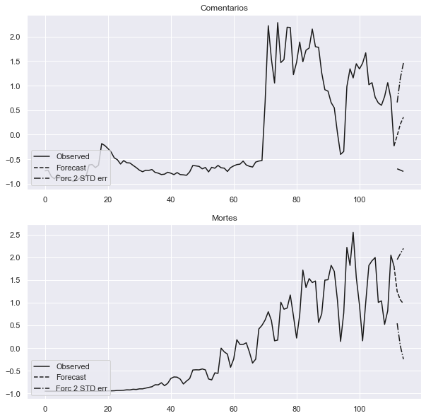

Da mesma maneira, ambas as séries são não estacionárias, portanto serão transformadas com o atraso de 1 dia.

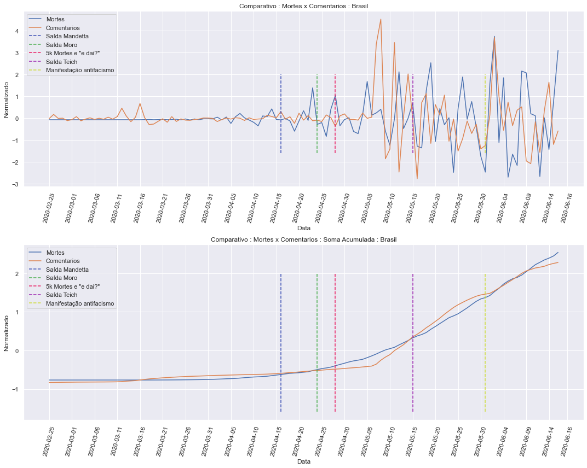

    Augmented Dickey-Fuller Test:
    ------------------------------
    
    Comentarios:
    ------------------------------
    ADF Statistic: -3.679712
    p-value: 0.004408
    Critical Values:
     - 1%: -3.498
     - 5%: -2.891
     - 10%: -2.582
    Is the time series stationary? True
    
    Mortes:
    ------------------------------
    ADF Statistic: -0.854053
    p-value: 0.802727
    Critical Values:
     - 1%: -3.496
     - 5%: -2.890
     - 10%: -2.582
    Is the time series stationary? False
    
    
    Engle-Granger Test:
    ------------------------------
    
    ADF Statistic: -4.818403
    p-value: 0.000040
    Critical Values:
     - 1%: nan
     - 5%: nan
     - 10%: nan
    Is time series cointegrate? True
    
    !!! Can find a model that could fit the series, please make the series stationary !!!

---

### Período Parcial

Conforme mencionado será analisado parte do período (a partir de 05/05).

#### Novos Casos x Comentários Positivos

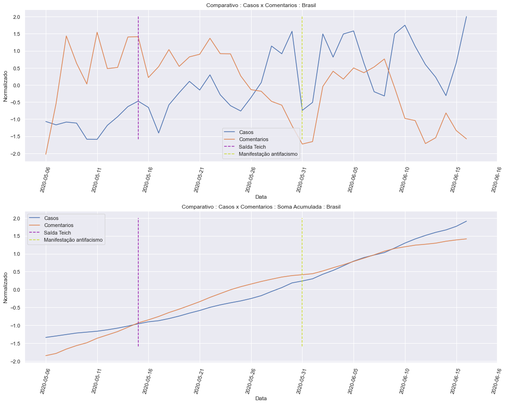

    Augmented Dickey-Fuller Test:
    ------------------------------
    
    Comentarios:
    ------------------------------
    ADF Statistic: -3.137070
    p-value: 0.023929
    Critical Values:
     - 1%: -3.597
     - 5%: -2.933
     - 10%: -2.605
    Is the time series stationary? True
    
    Casos:
    ------------------------------
    ADF Statistic: -1.904398
    p-value: 0.329995
    Critical Values:
     - 1%: -3.627
     - 5%: -2.946
     - 10%: -2.612
    Is the time series stationary? False
    
    
    Engle-Granger Test:
    ------------------------------
    
    ADF Statistic: -3.960328
    p-value: 0.001260
    Critical Values:
     - 1%: nan
     - 5%: nan
     - 10%: nan
    Is time series cointegrate? True
    
    !!! Can find a model that could fit the series, please make the series stationary !!!

#### Mortes x Comentários Positivos

Dando sequência as validações, faz-se a verificação se os comentários no Twitter possuem uma relação causal na quantidade de mortes que ocorrem.

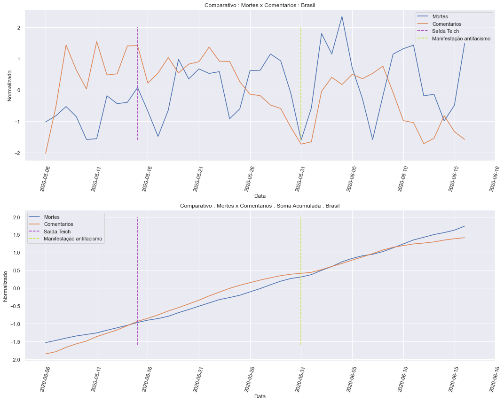

    Augmented Dickey-Fuller Test:
    ------------------------------
    
    Comentarios:
    ------------------------------
    ADF Statistic: -3.137070
    p-value: 0.023929
    Critical Values:
     - 1%: -3.597
     - 5%: -2.933
     - 10%: -2.605
    Is the time series stationary? True
    
    Mortes:
    ------------------------------
    ADF Statistic: -2.582072
    p-value: 0.096760
    Critical Values:
     - 1%: -3.627
     - 5%: -2.946
     - 10%: -2.612
    Is the time series stationary? False
    
    
    Engle-Granger Test:
    ------------------------------
    
    ADF Statistic: -4.284235
    p-value: 0.011535
    Critical Values:
     - 1%: -4.715
     - 5%: -4.014
     - 10%: -3.669
    Is time series cointegrate? True
    
    !!! Can find a model that could fit the series, please make the series stationary !!!

---

### Período completo por estados

#### Novos Casos x Comentários Positivos (Sao Paulo)

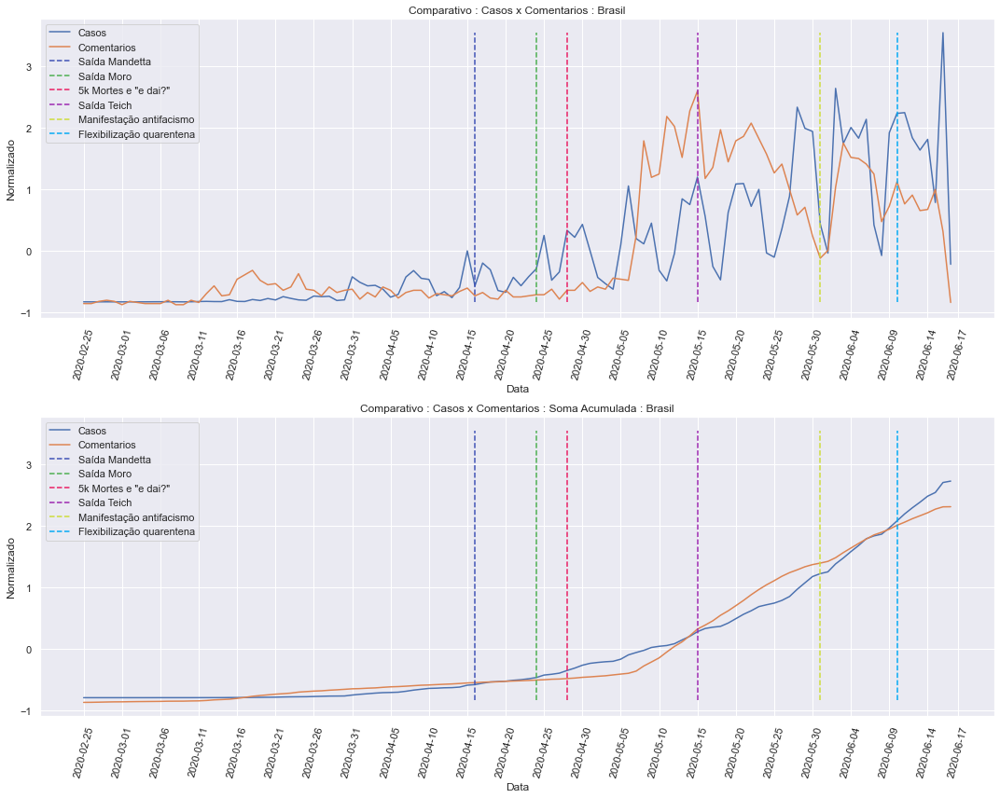

    Augmented Dickey-Fuller Test:
    ------------------------------
    
    Comentarios:
    ------------------------------
    ADF Statistic: -1.842645
    p-value: 0.359504
    Critical Values:
     - 1%: -3.491
     - 5%: -2.888
     - 10%: -2.581
    Is the time series stationary? False
    
    Casos:
    ------------------------------
    ADF Statistic: 1.730940
    p-value: 0.998202
    Critical Values:
     - 1%: -3.499
     - 5%: -2.892
     - 10%: -2.583
    Is the time series stationary? False
    
    
    Engle-Granger Test:
    ------------------------------
    
    ADF Statistic: -2.664811
    p-value: 0.063145
    Critical Values:
     - 1%: nan
     - 5%: nan
     - 10%: nan
    Is time series cointegrate? False
    
    !!! Can find a model that could fit the series, please make the series stationary !!!

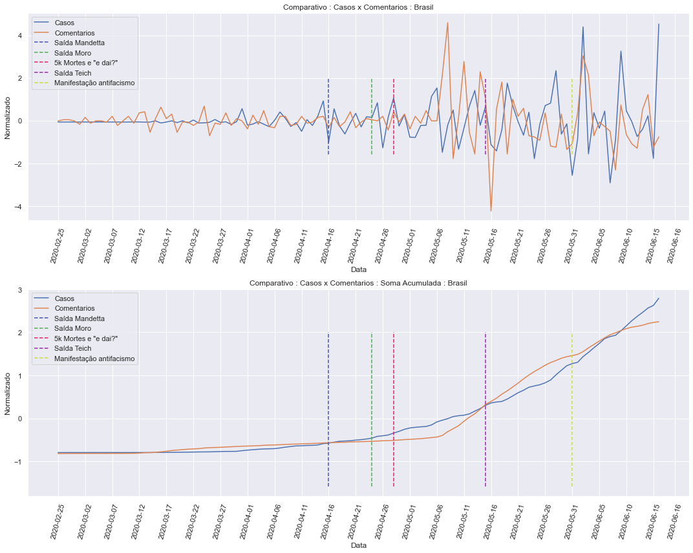

    Augmented Dickey-Fuller Test:
    ------------------------------
    
    Comentarios:
    ------------------------------
    ADF Statistic: -4.822847
    p-value: 0.000049
    Critical Values:
     - 1%: -3.491
     - 5%: -2.888
     - 10%: -2.581
    Is the time series stationary? True
    
    Casos:
    ------------------------------
    ADF Statistic: -2.867093
    p-value: 0.049311
    Critical Values:
     - 1%: -3.498
     - 5%: -2.891
     - 10%: -2.582
    Is the time series stationary? True
    
    
    Engle-Granger Test:
    ------------------------------
    
    ADF Statistic: -10.328175
    p-value: 0.000000
    Critical Values:
     - 1%: nan
     - 5%: nan
     - 10%: nan
    Is time series cointegrate? True
    
    Vector Autoregressions (VAR):
    ------------------------------
    Granger causality F-test. H_0: Comentarios does not Granger-cause Casos. Conclusion: reject H_0 at 5% significance level.
    ==============================================
    Test statistic Critical value p-value    df   
    ----------------------------------------------
             5.453          3.884   0.020 (1, 220)
    ----------------------------------------------
    
    
    Instantaneous causality Wald-test. H_0: Comentarios does not instantaneously cause Casos. Conclusion: fail to reject H_0 at 5% significance level.
    ========================================
    Test statistic Critical value p-value df
    ----------------------------------------
             2.575          3.841   0.109  1
    ----------------------------------------

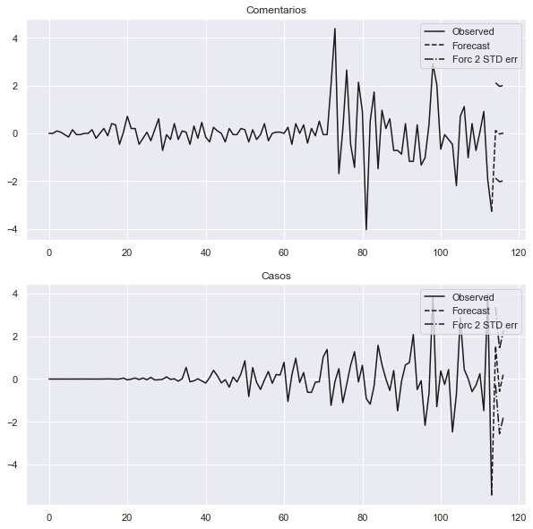

#### Novos Casos x Comentários Positivos (Rio de Janeiro)

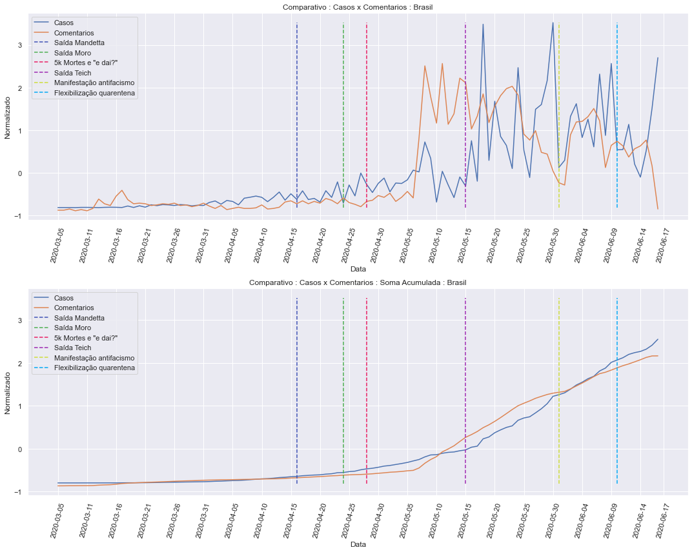

    Augmented Dickey-Fuller Test:
    ------------------------------
    
    Comentarios:
    ------------------------------
    ADF Statistic: -1.882805
    p-value: 0.340193
    Critical Values:
     - 1%: -3.498
     - 5%: -2.891
     - 10%: -2.582
    Is the time series stationary? False
    
    Casos:
    ------------------------------
    ADF Statistic: -0.652231
    p-value: 0.858738
    Critical Values:
     - 1%: -3.506
     - 5%: -2.895
     - 10%: -2.584
    Is the time series stationary? False
    
    
    Engle-Granger Test:
    ------------------------------
    
    ADF Statistic: -2.487626
    p-value: 0.094151
    Critical Values:
     - 1%: nan
     - 5%: nan
     - 10%: nan
    Is time series cointegrate? False
    
    !!! Can find a model that could fit the series, please make the series stationary !!!

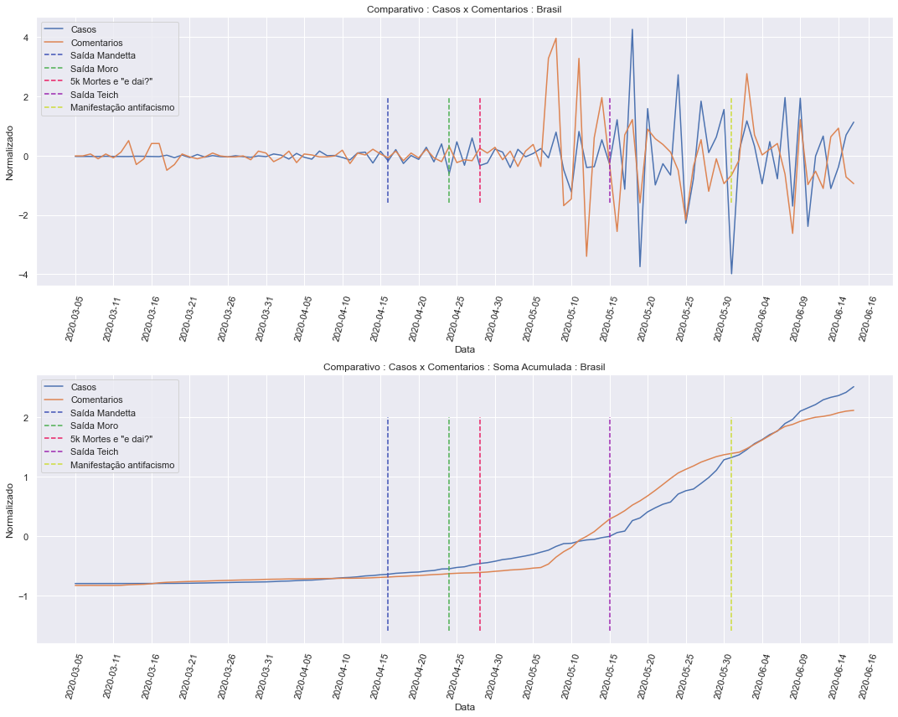

    Augmented Dickey-Fuller Test:
    ------------------------------
    
    Comentarios:
    ------------------------------
    ADF Statistic: -5.300269
    p-value: 0.000005
    Critical Values:
     - 1%: -3.498
     - 5%: -2.891
     - 10%: -2.583
    Is the time series stationary? True
    
    Casos:
    ------------------------------
    ADF Statistic: -2.215743
    p-value: 0.200581
    Critical Values:
     - 1%: -3.505
     - 5%: -2.894
     - 10%: -2.584
    Is the time series stationary? False
    
    
    Engle-Granger Test:
    ------------------------------
    
    ADF Statistic: -9.051401
    p-value: 0.000000
    Critical Values:
     - 1%: nan
     - 5%: nan
     - 10%: nan
    Is time series cointegrate? True
    
    !!! Can find a model that could fit the series, please make the series stationary !!!

