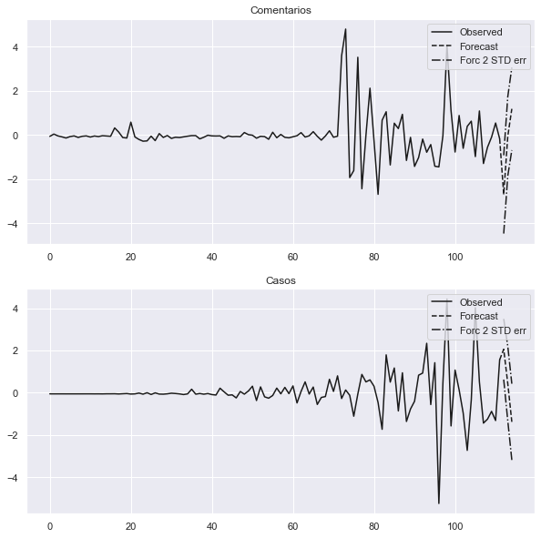
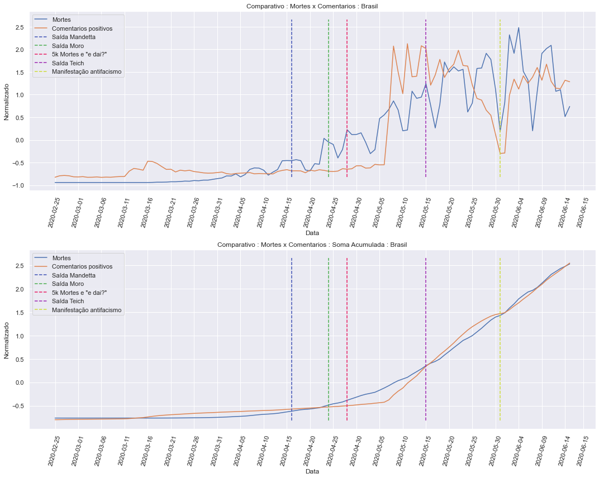
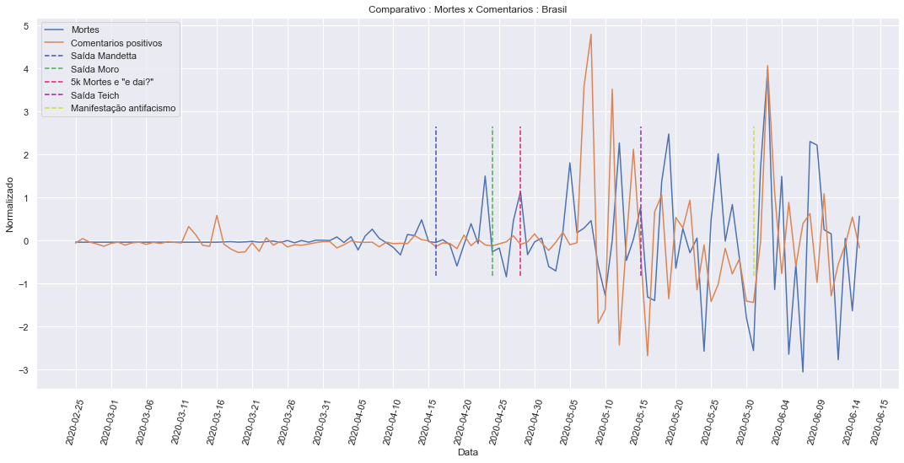

## Informações da base de dados

    Qtde. de Comentários            : 250385
    Qtde. de Comentários positivos  : 85995
    Qtde. de Comentários negativos  : 164390
    ----------------------------------------
    Qtde. de Usuários geolocalizados: 62336
    Qtde. de Usuários em SP         : 12304
    Qtde. de Usuários em RJ         : 12914

Exemplos de comentários com suas classificações:

    negativo|Fora do normal o quanto eu estou com saudades do meu padrinho e não posso ir vê-lo por causa desse corona
    negativo|caras falta de ar é sintoma do coronga?
    negativo|Em resposta a  @QuebrandoOTabu  e  @letrapreta Eu tive que trabalhar durante a pandemia, agora estou em isolamento com Covid, quando vão abrir os olhos para realidade? Precisamos de lockdown já!
    negativo|Em resposta a  @dantegalileu Eu já fui essa criança (e sou assim até hj), vivo tendo dor de garganta kakakakaka
    negativo|apesar dos sonhos agitados e com falta de ar eu tbm tenho sonhado muito com meu avô e sempre eh uma sensação mt boa

## Nuvens de palavras

Nuvem de palavras de todos os comentários na base de dados.

Nuvens de palavras apenas de comentários classificados como positivos.

## Visualizações dos dados

    Augmented Dickey-Fuller Test:
    ------------------------------
    
    Comentarios:
    ------------------------------
    ADF Statistic: -1.378059
    p-value: 0.592748
    Critical Values:
     - 1%: -3.492
     - 5%: -2.889
     - 10%: -2.581
    Is the time series stationary? False
    
    Casos:
    ------------------------------
    ADF Statistic: 0.760653
    p-value: 0.990974
    Critical Values:
     - 1%: -3.495
     - 5%: -2.890
     - 10%: -2.582
    Is the time series stationary? False
    
    
    Engle-Granger Test:
    ------------------------------
    
    ADF Statistic: -3.099826
    p-value: 0.088338
    Critical Values:
     - 1%: -3.998
     - 5%: -3.392
     - 10%: -3.083
    Is time series cointegrate? False
    
    !!! Can find a model that could fit the series, please make the series stationary !!!

    Augmented Dickey-Fuller Test:
    ------------------------------
    
    Comentarios:
    ------------------------------
    ADF Statistic: -5.563505
    p-value: 0.000002
    Critical Values:
     - 1%: -3.492
     - 5%: -2.888
     - 10%: -2.581
    Is the time series stationary? True
    
    Casos:
    ------------------------------
    ADF Statistic: -3.589975
    p-value: 0.005956
    Critical Values:
     - 1%: -3.495
     - 5%: -2.890
     - 10%: -2.582
    Is the time series stationary? True
    
    
    Engle-Granger Test:
    ------------------------------
    
    ADF Statistic: -5.392792
    p-value: 0.000029
    Critical Values:
     - 1%: -3.998
     - 5%: -3.392
     - 10%: -3.083
    Is time series cointegrate? True
    
    Granger causality F-test. H_0: Comentarios does not Granger-cause Casos. Conclusion: fail to reject H_0 at 5% significance level.
    ===============================================
    Test statistic Critical value p-value     df   
    -----------------------------------------------
             1.341          1.817   0.201 (12, 150)
    -----------------------------------------------
    
    
    Instantaneous causality Wald-test. H_0: Comentarios does not instantaneously cause Casos. Conclusion: reject H_0 at 5% significance level.
    ========================================
    Test statistic Critical value p-value df
    ----------------------------------------
             4.803          3.841   0.028  1
    ----------------------------------------

    Augmented Dickey-Fuller Test:
    ------------------------------
    
    Comentarios:
    ------------------------------
    ADF Statistic: -1.378059
    p-value: 0.592748
    Critical Values:
     - 1%: -3.492
     - 5%: -2.889
     - 10%: -2.581
    Is the time series stationary? False
    
    Mortes:
    ------------------------------
    ADF Statistic: 0.151111
    p-value: 0.969382
    Critical Values:
     - 1%: -3.499
     - 5%: -2.892
     - 10%: -2.583
    Is the time series stationary? False
    
    
    Engle-Granger Test:
    ------------------------------
    
    ADF Statistic: -3.467047
    p-value: 0.035431
    Critical Values:
     - 1%: -3.998
     - 5%: -3.392
     - 10%: -3.083
    Is time series cointegrate? True
    
    Granger causality F-test. H_0: Comentarios does not Granger-cause Mortes. Conclusion: reject H_0 at 5% significance level.
    ==============================================
    Test statistic Critical value p-value    df   
    ----------------------------------------------
             10.96          1.810   0.000 (31, 32)
    ----------------------------------------------
    
    
    Instantaneous causality Wald-test. H_0: Comentarios does not instantaneously cause Mortes. Conclusion: reject H_0 at 5% significance level.
    ========================================
    Test statistic Critical value p-value df
    ----------------------------------------
             13.05          3.841   0.000  1
    ----------------------------------------

    Augmented Dickey-Fuller Test:
    ------------------------------
    
    Comentarios:
    ------------------------------
    ADF Statistic: -1.891153
    p-value: 0.336234
    Critical Values:
     - 1%: -3.499
     - 5%: -2.892
     - 10%: -2.583
    Is the time series stationary? False
    
    Mortes:
    ------------------------------
    ADF Statistic: -5.563505
    p-value: 0.000002
    Critical Values:
     - 1%: -3.492
     - 5%: -2.888
     - 10%: -2.581
    Is the time series stationary? True
    
    
    Engle-Granger Test:
    ------------------------------
    
    ADF Statistic: -1.117721
    p-value: 0.878151
    Critical Values:
     - 1%: -3.998
     - 5%: -3.392
     - 10%: -3.083
    Is time series cointegrate? False
    
    !!! Can find a model that could fit the series, please make the series stationary !!!

