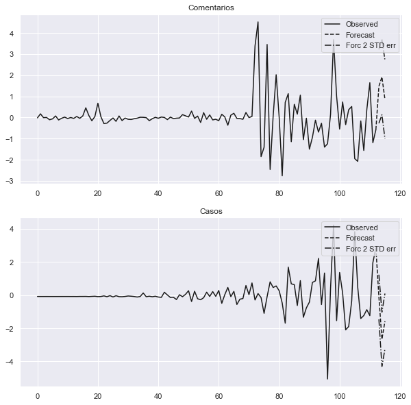
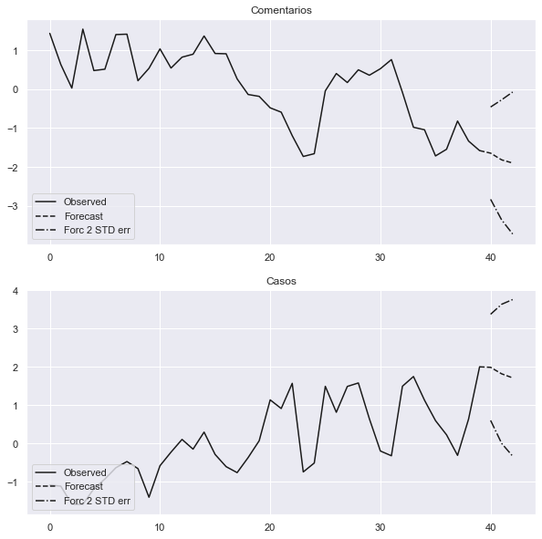

## Informações da base de dados

    Qtde. de Comentários            : 283392
    Qtde. de Comentários positivos  : 109490
    Qtde. de Comentários negativos  : 139147
    ----------------------------------------
    Qtde. de Usuários geolocalizados: 64899
    Qtde. de Usuários em SP         : 12763
    Qtde. de Usuários em RJ         : 13513

Exemplos de comentários com suas classificações:

    negativo|Minha mãe vai começar a fazer aula de zumba amanhã, se eu não peguei corona até agora, agora eu pego
    positivo|Uma falta de ar
    positivo|EU NUNCA TINHA VISTO ESSE VÍDEO INTEIRO. EU TO COM FALTA DE AR
    negativo|Em resposta a  @carolinaprivv1 vamos as duas mana , febre não está a passar :(
    positivo|Rafa com febre parte meu coração

## Nuvens de palavras

Nuvem de palavras de todos os comentários na base de dados.

Nuvens de palavras apenas de comentários classificados como positivos.

## Visualizações dos dados

## Verificação de Causalidade

Lembrando as perguntas as quais deseja-se responder sobre essa análise:

 - É possível identificar a disseminação da COVID-19 no Brasil, através do conteúdo de redes sociais?
 - Sendo possível:
  - Com que grau de certeza a disseminação de COVID-19 é identificada?
  - Com que antecedência podemos identificar a disseminação da doença (em dias/semanas)?
  - Considerando que boa parte do conteúdo extraído não terá informações de geolocalização, é possível verificar essa disseminação por cidades ou estados?
  
Neste sentido, será necessário validar as séries temporais da quantidade de comentários ao longo de determinado período e a de Novo Casos / Mortes ao longo da pandemia.

Para esta análise, foi definido alguns limites:

 - Será feito uma análise do período todo de coleta.
  - Com relação a análise do período todo, é importante notar que a quantidade de comentários no Twitter da um grande salto a partir do dia 05/05, dessa maneira, será realizada uma análise deste período em diante para verificar se existe alguma modificação na relação causal.
 - Como visto acima, será selecionado apenas a análise dos estados de São Paulo e Rio de Janeiro por possuirem maior quantidade de comentários.

Estima-se que exite cerca de 8 milhões e 280 mil usuários no Twitter, entretanto no Brasil, tem-se aproximadamente 212 milhões de habitantes. Visto essa discrepância na quantidade de pessoas, para uma análise mais direcionada, os dados serão estandardizados:

$z = \frac{(x - \mu)}{\sigma}$

Após isso, para a análise de série temporais leva em consideração alguns aspectos.

A análise deve levar em consideração se as séries são estacionárias ou não. Sendo ambas estacionárias pode-se usar o modelo VAR (Vector Autoregression), que através deste pode-se validar a causalidade de Granger e instantânea entre as séries, além da possibilidade de predição (forecast).

Caso ambas as séries não sejam estacionárias, é válida a verificação se as mesmas são cointegradas, e se forem utiliza-se o modelo VECM (Vector Error Correction Models) permitindo a mesma validação que a apresentada pelo modelo VAR.

Se mesmo assim, não for possível aplicar nenhum do dois modelos, uma outra tentativa é transformar as séries (removendo um pequeno atraso (1 dia)) para que se tornem estacionárias. Feito isso o modelo VAR pode ser aplicado.

Para a verificar se as séries são estacionárias, é possível usar o teste de Dickey-Fuller, que verifica se as séries possuem raiz unitária.

No caso da verificação para validar se as séries são cointegradas, utiliza-se o teste de Engle-Granger.

### Período Completo

Como primeira análise, será aplicado o mencionado acima, na série temporal toda desde o "começo" da pandemia.

#### Novos Casos x Comentários Positivos

    Augmented Dickey-Fuller Test:
    ------------------------------
    
    Comentarios:
    ------------------------------
    ADF Statistic: -1.430894
    p-value: 0.567379
    Critical Values:
     - 1%: -3.497
     - 5%: -2.891
     - 10%: -2.582
    Is the time series stationary? False
    
    Casos:
    ------------------------------
    ADF Statistic: 1.022437
    p-value: 0.994497
    Critical Values:
     - 1%: -3.495
     - 5%: -2.890
     - 10%: -2.582
    Is the time series stationary? False
    
    
    Engle-Granger Test:
    ------------------------------
    
    ADF Statistic: -1.678707
    p-value: 0.686558
    Critical Values:
     - 1%: -3.997
     - 5%: -3.391
     - 10%: -3.083
    Is time series cointegrate? False
    
    !!! Can find a model that could fit the series, please make the series stationary !!!

Devido a ambas as séries não serem estacionárias, transforma-se ambas as séries removendo o atraso de 1 dia em ambas, tornando-as séries estacionárias.

    Augmented Dickey-Fuller Test:
    ------------------------------
    
    Comentarios:
    ------------------------------
    ADF Statistic: -3.043767
    p-value: 0.031004
    Critical Values:
     - 1%: -3.496
     - 5%: -2.890
     - 10%: -2.582
    Is the time series stationary? True
    
    Casos:
    ------------------------------
    ADF Statistic: -3.523951
    p-value: 0.007393
    Critical Values:
     - 1%: -3.494
     - 5%: -2.889
     - 10%: -2.582
    Is the time series stationary? True
    
    
    Engle-Granger Test:
    ------------------------------
    
    ADF Statistic: -3.025488
    p-value: 0.104271
    Critical Values:
     - 1%: -3.997
     - 5%: -3.391
     - 10%: -3.083
    Is time series cointegrate? False
    
    Vector Autoregressions (VAR):
    ------------------------------
    Granger causality F-test. H_0: Comentarios does not Granger-cause Casos. Conclusion: fail to reject H_0 at 5% significance level.
    ===============================================
    Test statistic Critical value p-value     df   
    -----------------------------------------------
             1.338          1.816   0.203 (12, 152)
    -----------------------------------------------
    
    
    Instantaneous causality Wald-test. H_0: Comentarios does not instantaneously cause Casos. Conclusion: reject H_0 at 5% significance level.
    ========================================
    Test statistic Critical value p-value df
    ----------------------------------------
             7.474          3.841   0.006  1
    ----------------------------------------

#### Mortes x Comentários Positivos

Dando sequência as validações, faz-se a verificação se os comentários no Twitter possuem uma relação causal na quantidade de mortes que ocorrem.

    Augmented Dickey-Fuller Test:
    ------------------------------
    
    Comentarios:
    ------------------------------
    ADF Statistic: -1.430894
    p-value: 0.567379
    Critical Values:
     - 1%: -3.497
     - 5%: -2.891
     - 10%: -2.582
    Is the time series stationary? False
    
    Mortes:
    ------------------------------
    ADF Statistic: 0.451558
    p-value: 0.983324
    Critical Values:
     - 1%: -3.498
     - 5%: -2.891
     - 10%: -2.583
    Is the time series stationary? False
    
    
    Engle-Granger Test:
    ------------------------------
    
    ADF Statistic: -1.876285
    p-value: 0.591985
    Critical Values:
     - 1%: -3.997
     - 5%: -3.391
     - 10%: -3.083
    Is time series cointegrate? False
    
    !!! Can find a model that could fit the series, please make the series stationary !!!

Da mesma maneira, ambas as séries são não estacionárias, portanto serão transformadas com o atraso de 1 dia.

    Augmented Dickey-Fuller Test:
    ------------------------------
    
    Comentarios:
    ------------------------------
    ADF Statistic: -3.043767
    p-value: 0.031004
    Critical Values:
     - 1%: -3.496
     - 5%: -2.890
     - 10%: -2.582
    Is the time series stationary? True
    
    Mortes:
    ------------------------------
    ADF Statistic: -1.869122
    p-value: 0.346723
    Critical Values:
     - 1%: -3.498
     - 5%: -2.891
     - 10%: -2.583
    Is the time series stationary? False
    
    
    Engle-Granger Test:
    ------------------------------
    
    ADF Statistic: -3.037122
    p-value: 0.101643
    Critical Values:
     - 1%: -3.997
     - 5%: -3.391
     - 10%: -3.083
    Is time series cointegrate? False
    
    !!! Can find a model that could fit the series, please make the series stationary !!!

---

### Período Parcial

Conforme mencionado será analisado parte do período (a partir de 05/05).

#### Novos Casos x Comentários Positivos

    Augmented Dickey-Fuller Test:
    ------------------------------
    
    Comentarios:
    ------------------------------
    ADF Statistic: -2.681546
    p-value: 0.077286
    Critical Values:
     - 1%: -3.601
     - 5%: -2.935
     - 10%: -2.606
    Is the time series stationary? False
    
    Casos:
    ------------------------------
    ADF Statistic: -1.695043
    p-value: 0.433668
    Critical Values:
     - 1%: -3.633
     - 5%: -2.949
     - 10%: -2.613
    Is the time series stationary? False
    
    
    Engle-Granger Test:
    ------------------------------
    
    ADF Statistic: -3.640100
    p-value: 0.021837
    Critical Values:
     - 1%: -4.184
     - 5%: -3.489
     - 10%: -3.15
    Is time series cointegrate? True
    
    Vector Error Correction Models (VECM):
    ------------------------------
    Granger causality F-test. H_0: Comentarios does not Granger-cause Casos. Conclusion: fail to reject H_0 at 5% significance level.
    =============================================
    Test statistic Critical value p-value    df  
    ---------------------------------------------
            0.4253          3.136   0.655 (2, 66)
    ---------------------------------------------
    
    
    Instantaneous causality Wald-test. H_0: Comentarios does not instantaneously cause Casos. Conclusion: fail to reject H_0 at 5% significance level.
    ========================================
    Test statistic Critical value p-value df
    ----------------------------------------
            0.4558          3.841   0.500  1
    ----------------------------------------

#### Mortes x Comentários Positivos

Dando sequência as validações, faz-se a verificação se os comentários no Twitter possuem uma relação causal na quantidade de mortes que ocorrem.

    Augmented Dickey-Fuller Test:
    ------------------------------
    
    Comentarios:
    ------------------------------
    ADF Statistic: -2.681546
    p-value: 0.077286
    Critical Values:
     - 1%: -3.601
     - 5%: -2.935
     - 10%: -2.606
    Is the time series stationary? False
    
    Mortes:
    ------------------------------
    ADF Statistic: -2.439931
    p-value: 0.130782
    Critical Values:
     - 1%: -3.633
     - 5%: -2.949
     - 10%: -2.613
    Is the time series stationary? False
    
    
    Engle-Granger Test:
    ------------------------------
    
    ADF Statistic: -2.803613
    p-value: 0.164538
    Critical Values:
     - 1%: -4.184
     - 5%: -3.489
     - 10%: -3.15
    Is time series cointegrate? False
    
    !!! Can find a model that could fit the series, please make the series stationary !!!

---

### Período completo por estados

#### Novos Casos x Comentários Positivos (Sao Paulo)

    Augmented Dickey-Fuller Test:
    ------------------------------
    
    Comentarios:
    ------------------------------
    ADF Statistic: -1.892616
    p-value: 0.335543
    Critical Values:
     - 1%: -3.498
     - 5%: -2.891
     - 10%: -2.583
    Is the time series stationary? False
    
    Casos:
    ------------------------------
    ADF Statistic: 3.792974
    p-value: 1.000000
    Critical Values:
     - 1%: -3.499
     - 5%: -2.892
     - 10%: -2.583
    Is the time series stationary? False
    
    
    Engle-Granger Test:
    ------------------------------
    
    ADF Statistic: -1.533570
    p-value: 0.748096
    Critical Values:
     - 1%: -3.998
     - 5%: -3.392
     - 10%: -3.083
    Is time series cointegrate? False
    
    !!! Can find a model that could fit the series, please make the series stationary !!!

    Augmented Dickey-Fuller Test:
    ------------------------------
    
    Comentarios:
    ------------------------------
    ADF Statistic: -1.970795
    p-value: 0.299524
    Critical Values:
     - 1%: -3.498
     - 5%: -2.891
     - 10%: -2.582
    Is the time series stationary? False
    
    Casos:
    ------------------------------
    ADF Statistic: -3.044906
    p-value: 0.030908
    Critical Values:
     - 1%: -3.499
     - 5%: -2.892
     - 10%: -2.583
    Is the time series stationary? True
    
    
    Engle-Granger Test:
    ------------------------------
    
    ADF Statistic: -1.875808
    p-value: 0.592225
    Critical Values:
     - 1%: -3.998
     - 5%: -3.392
     - 10%: -3.083
    Is time series cointegrate? False
    
    !!! Can find a model that could fit the series, please make the series stationary !!!

#### Novos Casos x Comentários Positivos (Rio de Janeiro)

    Augmented Dickey-Fuller Test:
    ------------------------------
    
    Comentarios:
    ------------------------------
    ADF Statistic: -1.592265
    p-value: 0.487478
    Critical Values:
     - 1%: -3.500
     - 5%: -2.892
     - 10%: -2.583
    Is the time series stationary? False
    
    Casos:
    ------------------------------
    ADF Statistic: -0.234108
    p-value: 0.934332
    Critical Values:
     - 1%: -3.503
     - 5%: -2.893
     - 10%: -2.584
    Is the time series stationary? False
    
    
    Engle-Granger Test:
    ------------------------------
    
    ADF Statistic: -1.777962
    p-value: 0.640364
    Critical Values:
     - 1%: -4.007
     - 5%: -3.397
     - 10%: -3.086
    Is time series cointegrate? False
    
    !!! Can find a model that could fit the series, please make the series stationary !!!

    Augmented Dickey-Fuller Test:
    ------------------------------
    
    Comentarios:
    ------------------------------
    ADF Statistic: -5.342789
    p-value: 0.000004
    Critical Values:
     - 1%: -3.499
     - 5%: -2.892
     - 10%: -2.583
    Is the time series stationary? True
    
    Casos:
    ------------------------------
    ADF Statistic: -1.528960
    p-value: 0.519140
    Critical Values:
     - 1%: -3.506
     - 5%: -2.895
     - 10%: -2.584
    Is the time series stationary? False
    
    
    Engle-Granger Test:
    ------------------------------
    
    ADF Statistic: -5.588451
    p-value: 0.000012
    Critical Values:
     - 1%: -4.007
     - 5%: -3.397
     - 10%: -3.086
    Is time series cointegrate? True
    
    !!! Can find a model that could fit the series, please make the series stationary !!!

