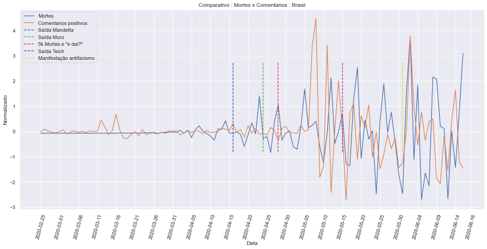
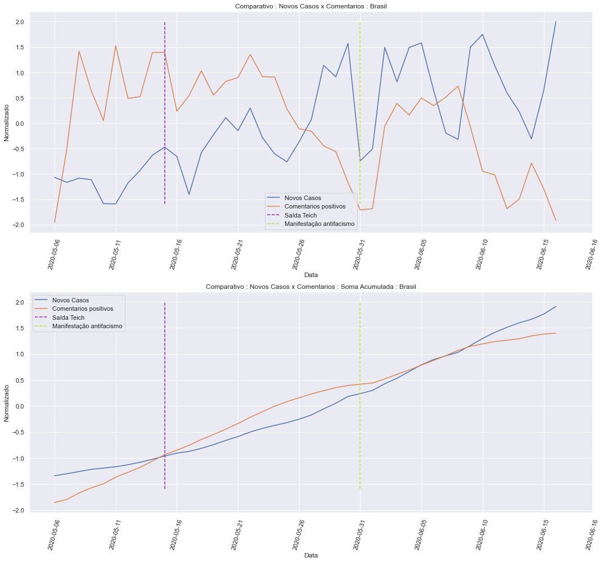

## Informações da base de dados

    Qtde. de Comentários            : 278694
    Qtde. de Comentários positivos  : 107571
    Qtde. de Comentários negativos  : 136368
    ----------------------------------------
    Qtde. de Usuários geolocalizados: 64026
    Qtde. de Usuários em SP         : 12630
    Qtde. de Usuários em RJ         : 13223

Exemplos de comentários com suas classificações:

    negativo|O peito dói, o olho enche d'água, a falta de ar vem ...  olá ansiedade
    positivo|só entrar no meu quarto pra começar essa tosse seca chata
    positivo|Só me faltava essa Pietro com febre.
    negativo|E foi assim que eu peguei corona Citar Tweet Débora @deborakjj  · 1 h minha irmã resolveu fazer uma festa aqui em casa hj e como protesto por essa palhaçada não vou limpar um banheiro sequer dessa casa
    positivo|Em resposta a  @ExposedAnonyBra Eu to c falta de ar real

## Nuvens de palavras

Nuvem de palavras de todos os comentários na base de dados.

Nuvens de palavras apenas de comentários classificados como positivos.

## Visualizações dos dados

## Verificação de Causalidade

Lembrando as perguntas as quais deseja-se responder sobre essa análise:

 - É possível identificar a disseminação da COVID-19 no Brasil, através do conteúdo de redes sociais?
 - Sendo possível:
  - Com que grau de certeza a disseminação de COVID-19 é identificada?
  - Com que antecedência podemos identificar a disseminação da doença (em dias/semanas)?
  - Considerando que boa parte do conteúdo extraído não terá informações de geolocalização, é possível verificar essa disseminação por cidades ou estados?
  
Neste sentido, será necessário validar as séries temporais da quantidade de comentários ao longo de determinado período e a de Novo Casos / Mortes ao longo da pandemia.

Para esta análise, foi definido alguns limites:

 - Será feito uma análise do período todo de coleta.
  - Com relação a análise do período todo, é importante notar que a quantidade de comentários no Twitter da um grande salto a partir do dia 05/05, dessa maneira, será realizada uma análise deste período em diante para verificar se existe alguma modificação na relação causal.
 - Como visto acima, será selecionado apenas a análise dos estados de São Paulo e Rio de Janeiro por possuirem maior quantidade de comentários.

Estima-se que exite cerca de 8 milhões e 280 mil usuários no Twitter, entretanto no Brasil, tem-se aproximadamente 212 milhões de habitantes. Visto essa discrepância na quantidade de pessoas, para uma análise mais direcionada, os dados serão estandardizados:

$z = \frac{(x - \mu)}{\sigma}$

Após isso, para a análise de série temporais leva em consideração alguns aspectos.

A análise deve levar em consideração se as séries são estacionárias ou não. Sendo ambas estacionárias pode-se usar o modelo VAR (Vector Autoregression), que através deste pode-se validar a causalidade de Granger e instantânea entre as séries, além da possibilidade de predição (forecast).

Caso ambas as séries não sejam estacionárias, é válida a verificação se as mesmas são cointegradas, e se forem utiliza-se o modelo VECM (Vector Error Correction Models) permitindo a mesma validação que a apresentada pelo modelo VAR.

Se mesmo assim, não for possível aplicar nenhum do dois modelos, uma outra tentativa é transformar as séries (removendo um pequeno atraso (1 dia)) para que se tornem estacionárias. Feito isso o modelo VAR pode ser aplicado.

Para a verificar se as séries são estacionárias, é possível usar o teste de Dickey-Fuller, que verifica se as séries possuem raiz unitária.

No caso da verificação para validar se as séries são cointegradas, utiliza-se o teste de Engle-Granger.

### Período Completo

Como primeira análise, será aplicado o mencionado acima, na série temporal toda desde o "começo" da pandemia.

#### Novos Casos x Comentários Positivos

    Augmented Dickey-Fuller Test:
    ------------------------------
    
    Comentarios:
    ------------------------------
    ADF Statistic: -1.519582
    p-value: 0.523803
    Critical Values:
     - 1%: -3.497
     - 5%: -2.891
     - 10%: -2.582
    Is the time series stationary? False
    
    Casos:
    ------------------------------
    ADF Statistic: 1.022437
    p-value: 0.994497
    Critical Values:
     - 1%: -3.495
     - 5%: -2.890
     - 10%: -2.582
    Is the time series stationary? False
    
    
    Engle-Granger Test:
    ------------------------------
    
    ADF Statistic: -1.623023
    p-value: 0.711075
    Critical Values:
     - 1%: -3.997
     - 5%: -3.391
     - 10%: -3.083
    Is time series cointegrate? False
    
    !!! Can find a model that could fit the series, please make the series stationary !!!

Devido a ambas as séries não serem estacionárias, transforma-se ambas as séries removendo o atraso de 1 dia em ambas, tornando-as séries estacionárias.

    Augmented Dickey-Fuller Test:
    ------------------------------
    
    Comentarios:
    ------------------------------
    ADF Statistic: -2.905280
    p-value: 0.044737
    Critical Values:
     - 1%: -3.496
     - 5%: -2.890
     - 10%: -2.582
    Is the time series stationary? True
    
    Casos:
    ------------------------------
    ADF Statistic: -3.523951
    p-value: 0.007393
    Critical Values:
     - 1%: -3.494
     - 5%: -2.889
     - 10%: -2.582
    Is the time series stationary? True
    
    
    Engle-Granger Test:
    ------------------------------
    
    ADF Statistic: -2.906760
    p-value: 0.134064
    Critical Values:
     - 1%: -3.997
     - 5%: -3.391
     - 10%: -3.083
    Is time series cointegrate? False
    
    Vector Autoregressions (VAR):
    ------------------------------
    Granger causality F-test. H_0: Comentarios does not Granger-cause Casos. Conclusion: fail to reject H_0 at 5% significance level.
    ===============================================
    Test statistic Critical value p-value     df   
    -----------------------------------------------
             1.305          1.816   0.221 (12, 152)
    -----------------------------------------------
    
    
    Instantaneous causality Wald-test. H_0: Comentarios does not instantaneously cause Casos. Conclusion: reject H_0 at 5% significance level.
    ========================================
    Test statistic Critical value p-value df
    ----------------------------------------
             7.461          3.841   0.006  1
    ----------------------------------------

#### Mortes x Comentários Positivos

Dando sequência as validações, faz-se a verificação se os comentários no Twitter possuem uma relação causal na quantidade de mortes que ocorrem.

    Augmented Dickey-Fuller Test:
    ------------------------------
    
    Comentarios:
    ------------------------------
    ADF Statistic: -1.519582
    p-value: 0.523803
    Critical Values:
     - 1%: -3.497
     - 5%: -2.891
     - 10%: -2.582
    Is the time series stationary? False
    
    Mortes:
    ------------------------------
    ADF Statistic: 0.451558
    p-value: 0.983324
    Critical Values:
     - 1%: -3.498
     - 5%: -2.891
     - 10%: -2.583
    Is the time series stationary? False
    
    
    Engle-Granger Test:
    ------------------------------
    
    ADF Statistic: -1.787845
    p-value: 0.635607
    Critical Values:
     - 1%: -3.997
     - 5%: -3.391
     - 10%: -3.083
    Is time series cointegrate? False
    
    !!! Can find a model that could fit the series, please make the series stationary !!!

Da mesma maneira, ambas as séries são não estacionárias, portanto serão transformadas com o atraso de 1 dia.

    Augmented Dickey-Fuller Test:
    ------------------------------
    
    Comentarios:
    ------------------------------
    ADF Statistic: -1.869122
    p-value: 0.346723
    Critical Values:
     - 1%: -3.498
     - 5%: -2.891
     - 10%: -2.583
    Is the time series stationary? False
    
    Mortes:
    ------------------------------
    ADF Statistic: -2.905280
    p-value: 0.044737
    Critical Values:
     - 1%: -3.496
     - 5%: -2.890
     - 10%: -2.582
    Is the time series stationary? True
    
    
    Engle-Granger Test:
    ------------------------------
    
    ADF Statistic: -1.974767
    p-value: 0.541667
    Critical Values:
     - 1%: -3.997
     - 5%: -3.391
     - 10%: -3.083
    Is time series cointegrate? False
    
    !!! Can find a model that could fit the series, please make the series stationary !!!

### Período Parcial

Conforme mencionado será analisado parte do período (a partir de 05/05).

#### Novos Casos x Comentários Positivos

    Augmented Dickey-Fuller Test:
    ------------------------------
    
    Comentarios:
    ------------------------------
    ADF Statistic: -2.487780
    p-value: 0.118476
    Critical Values:
     - 1%: -3.601
     - 5%: -2.935
     - 10%: -2.606
    Is the time series stationary? False
    
    Casos:
    ------------------------------
    ADF Statistic: -1.695043
    p-value: 0.433668
    Critical Values:
     - 1%: -3.633
     - 5%: -2.949
     - 10%: -2.613
    Is the time series stationary? False
    
    
    Engle-Granger Test:
    ------------------------------
    
    ADF Statistic: -3.536000
    p-value: 0.029335
    Critical Values:
     - 1%: -4.184
     - 5%: -3.489
     - 10%: -3.15
    Is time series cointegrate? True
    
    Vector Error Correction Models (VECM):
    ------------------------------
    Granger causality F-test. H_0: Comentarios does not Granger-cause Casos. Conclusion: fail to reject H_0 at 5% significance level.
    =============================================
    Test statistic Critical value p-value    df  
    ---------------------------------------------
            0.4114          3.136   0.664 (2, 66)
    ---------------------------------------------
    
    
    Instantaneous causality Wald-test. H_0: Comentarios does not instantaneously cause Casos. Conclusion: fail to reject H_0 at 5% significance level.
    ========================================
    Test statistic Critical value p-value df
    ----------------------------------------
            0.6537          3.841   0.419  1
    ----------------------------------------

#### Mortes x Comentários Positivos

Dando sequência as validações, faz-se a verificação se os comentários no Twitter possuem uma relação causal na quantidade de mortes que ocorrem.

    Augmented Dickey-Fuller Test:
    ------------------------------
    
    Comentarios:
    ------------------------------
    ADF Statistic: -2.487780
    p-value: 0.118476
    Critical Values:
     - 1%: -3.601
     - 5%: -2.935
     - 10%: -2.606
    Is the time series stationary? False
    
    Mortes:
    ------------------------------
    ADF Statistic: -2.439931
    p-value: 0.130782
    Critical Values:
     - 1%: -3.633
     - 5%: -2.949
     - 10%: -2.613
    Is the time series stationary? False
    
    
    Engle-Granger Test:
    ------------------------------
    
    ADF Statistic: -2.638459
    p-value: 0.222488
    Critical Values:
     - 1%: -4.184
     - 5%: -3.489
     - 10%: -3.15
    Is time series cointegrate? False
    
    !!! Can find a model that could fit the series, please make the series stationary !!!

