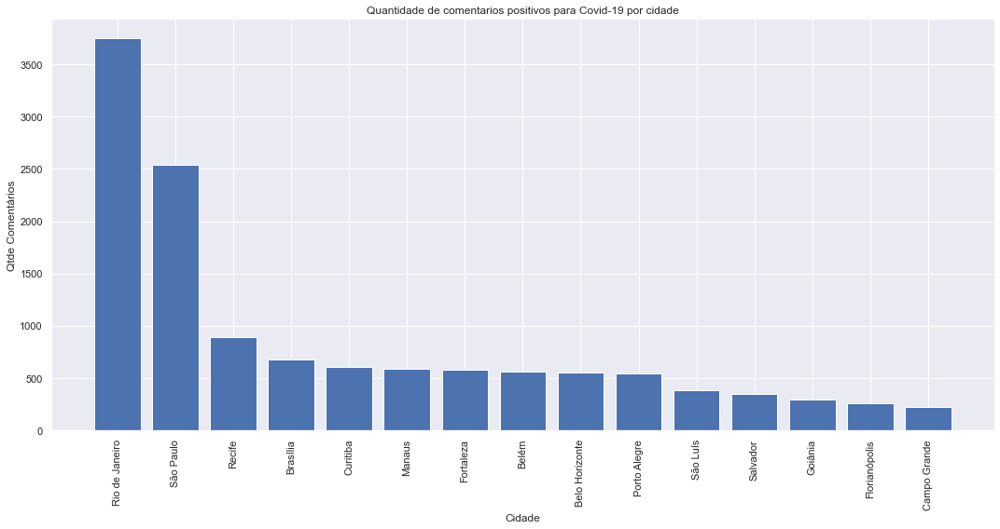
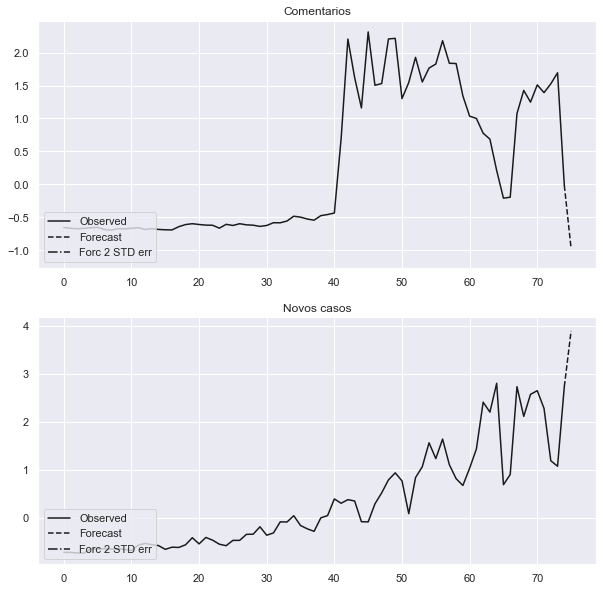

## Informações da base de dados

    Qtde. de Comentários            : 250385
    Qtde. de Comentários positivos  : 94704
    Qtde. de Comentários negativos  : 108275
    ----------------------------------------
    Qtde. de Usuários geolocalizados: 62336
    Qtde. de Usuários em SP         : 12304
    Qtde. de Usuários em RJ         : 12914

Exemplos de comentários com suas classificações:

    positivo|Em resposta a  @jrcorreaa Amiga, agora eu resolvo tudo  c estou com Covid.
    positivo|Só queria conseguir dormir em paz, mas essa dor de garganta fodida não me deixa
    negativo|Em resposta a  @_leosv Eu estou assim também Léo, mas ignorar completamente as mortes e as pessoas que estão sofrendo de maneira geral por conta do Corona e sair pra beber com os amigos fere totalmente o que eu sou e no que eu acredito
    negativo|o cara virou uma piada mesmo
    positivo|Dor de cabeça: a Eu: peguei covid puta merda  Corta pra eu lembrando q não como nada e nem tomo água a 7273726 horas

## Nuvens de palavras

Nuvem de palavras de todos os comentários na base de dados.

Nuvens de palavras apenas de comentários classificados como positivos.

## Visualizações dos dados

    Augmented Dickey-Fuller Test:
    ------------------------------
    
    Novos Casos:
    ------------------------------
    ADF Statistic: 3.915035
    p-value: 1.000000
    Critical Values:
     - 1%: -3.504
     - 5%: -2.894
     - 10%: -2.584
    Is the time series stationary? False
    
    Comentarios positivos:
    ------------------------------
    ADF Statistic: -1.862057
    p-value: 0.350116
    Critical Values:
     - 1%: -3.496
     - 5%: -2.890
     - 10%: -2.582
    Is the time series stationary? False
    
    
    Engle-Granger Test:
    ------------------------------
    
    ADF Statistic: -2.919012
    p-value: 0.130733
    Critical Values:
     - 1%: -4.004
     - 5%: -3.395
     - 10%: -3.085
    Is time series cointegrate? True

    Granger causality F-test. H_0: Comentarios does not Granger-cause Novos casos. Conclusion: reject H_0 at 5% significance level.
    ==============================================
    Test statistic Critical value p-value    df   
    ----------------------------------------------
             58.17          2.033   0.000 (31, 20)
    ----------------------------------------------
    
    
    Instantaneous causality Wald-test. H_0: Comentarios does not instantaneously cause Novos casos. Conclusion: reject H_0 at 5% significance level.
    ========================================
    Test statistic Critical value p-value df
    ----------------------------------------
             5.800          3.841   0.016  1
    ----------------------------------------

    Augmented Dickey-Fuller Test:
    ------------------------------
    
    Novas Mortes:
    ------------------------------
    ADF Statistic: 0.970476
    p-value: 0.993944
    Critical Values:
     - 1%: -3.504
     - 5%: -2.894
     - 10%: -2.584
    Is the time series stationary? False
    
    Comentarios positivos:
    ------------------------------
    ADF Statistic: -1.862057
    p-value: 0.350116
    Critical Values:
     - 1%: -3.496
     - 5%: -2.890
     - 10%: -2.582
    Is the time series stationary? False
    
    
    Engle-Granger Test:
    ------------------------------
    
    ADF Statistic: -2.856517
    p-value: 0.148363
    Critical Values:
     - 1%: -4.004
     - 5%: -3.395
     - 10%: -3.085
    Is time series cointegrate? True

    Granger causality F-test. H_0: Comentarios does not Granger-cause Mortes. Conclusion: reject H_0 at 5% significance level.
    ==============================================
    Test statistic Critical value p-value    df   
    ----------------------------------------------
             15.63          2.033   0.000 (31, 20)
    ----------------------------------------------
    
    
    Instantaneous causality Wald-test. H_0: Comentarios does not instantaneously cause Mortes. Conclusion: reject H_0 at 5% significance level.
    ========================================
    Test statistic Critical value p-value df
    ----------------------------------------
             17.73          3.841   0.000  1
    ----------------------------------------

