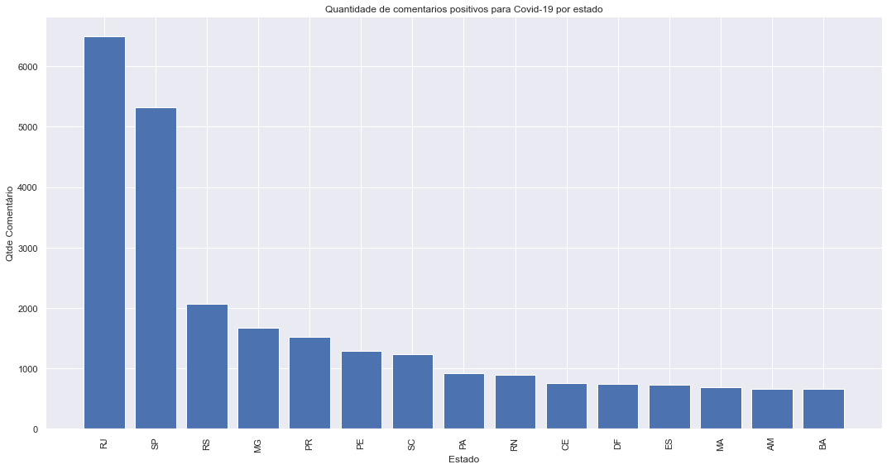
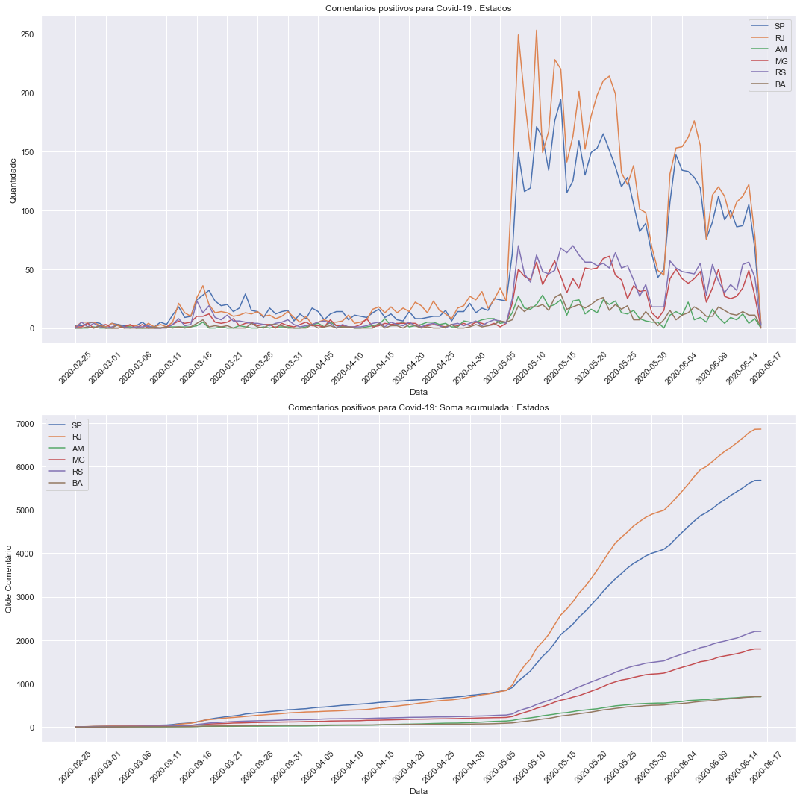
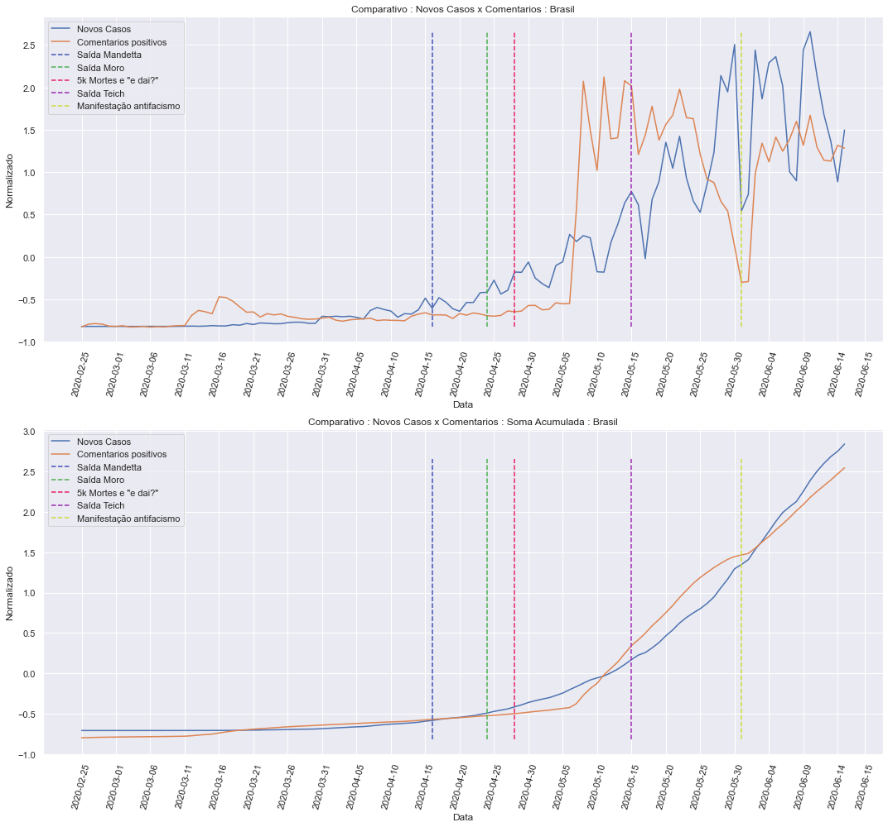
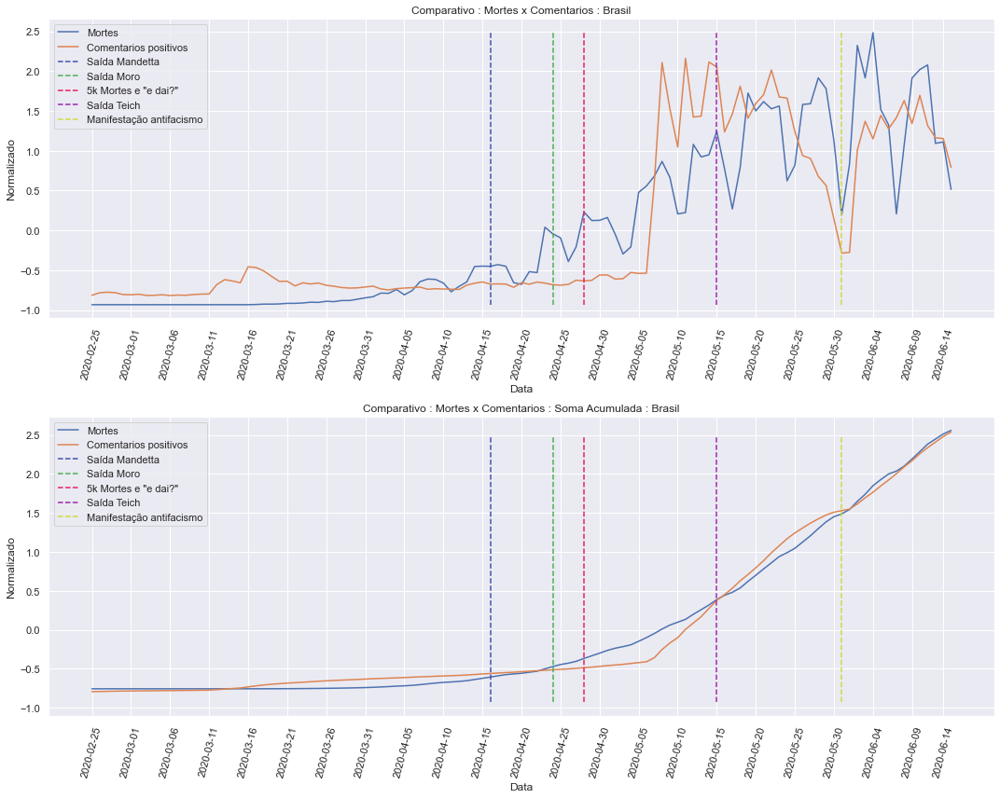

## Informações da base de dados

    Qtde. de Comentários               : 398001
    Qtde. de Comentários positivos     : 132631, 33%
    Qtde. de Comentários negativos     : 265370, 67%
    Qtde. de Comentários geolocalizados: 124159, 31%
    --------------------------------------------------
    Qtde. de Usuários geolocalizados   : 88766
    Qtde. de Usuários em SP            : 17539, 20%
    Qtde. de Usuários em RJ            : 18260, 21%

Exemplos de comentários com suas classificações:

    positivo|A dor de cabeça da covid foi de longe a pior dor de cabeça que eu já senti na vida.
    positivo|Tive gripe semana passada com dor de garganta e febre. Continuei com muita coriza e agora estou com muita tosse seca e dor de cabeça. Devo ir ao médico? #SP
    positivo|fora a febre e a dor de cabeça insuportáveellllll
    positivo|Não tô conseguindo deitar que me da falta de ar
    positivo|Febre infinita também, euein
    positivo|Do nada veio essa febre
    positivo|queimando em febre
    positivo|se for p morre q eu morrw logo vsf fica c essa enrolacao de falta de ar
    positivo|To numa tosse de cachorro pqp
    positivo|do nada eu começo com uma falta de ar surreal medo

## Nuvens de palavras

Nuvem de palavras de todos os comentários na base de dados.

Nuvens de palavras apenas de comentários classificados como positivos.

## Visualizações dos dados

