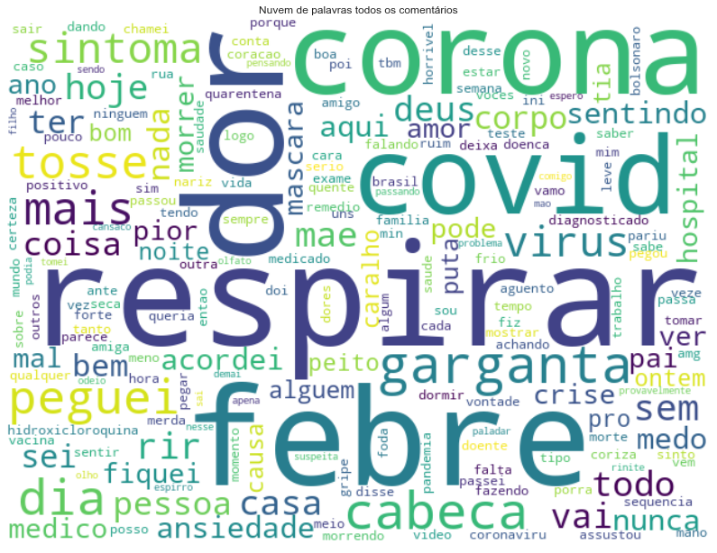
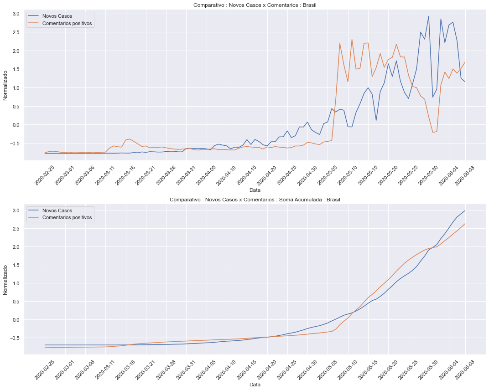

    Index(['date', 'country', 'state', 'city', 'ibgeID', 'newDeaths', 'deaths',
           'newCases', 'totalCases', 'deaths_per_100k_inhabitants',
           'totalCases_per_100k_inhabitants', 'deaths_by_totalCases', '_source'],
          dtype='object')

    Index(['hashtag', 'username', 'comment', 'data', 'timestamp', 'clean_comment',
           'sanitized_comment', 'classify'],
          dtype='object')
    Index(['id', 'username', 'city', 'state', 'region', 'geo'], dtype='object')

    Qtde. de Comentarios            : 205870
    Qtde. de Comentarios positivos  : 97400
    Qtde. de Comentarios negativos  : 108441
    ----------------------------------------
    Qtde. de Usuarios geolocalizados: 49144
    Qtde. de Usuarios em SP         : 9672
    Qtde. de Usuarios em RJ         : 10267

Exemplos de comentarios com suas classificacoes:

    negativo|Nossa querida  @fabianesecches  esta no Uol falando sobre a Febre Ferrante e seu livro, "Elena Ferrante: Uma longa experiência de ausência". Vem! Livro discute os best-sellers da 'Febre Ferrante' pelo olhar da psicanálise A psicanalista Fabiane Secches estava folheando um livro qualquer, em uma livraria, quando... tab.uol.com.br
    negativo|Em resposta a  @itskurdt n sejamos radical, n seja radical ! frio so da dor de garganta e resfriado, e quando você vai toma banho     PIOR AINDA, morro
    positivo|Tô com dor de cabeça, febre e tô ficando resfriado tnc
    negativo|Cada dia uma coisa ruim acontece não basta essa merda do corona vírus agora o preconceito resolveu atacar aff , cada vez o mundo me decepciona mais quando mais eu tenho esperança mais elas ficam para trás #VidasPretasImportam Estou com vcs vidas pretas importam
    positivo|Queria ter ido pra BC com as meninas mas fiquei com medo por conta do corona :/ só que eu estou trabalhando todos os dias já vsfd

