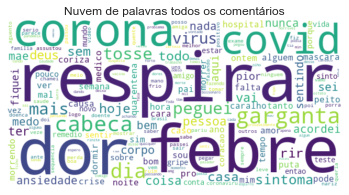
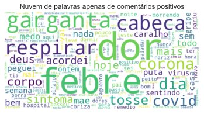
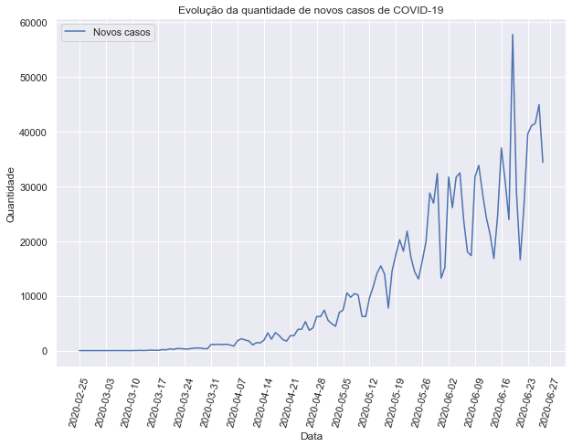
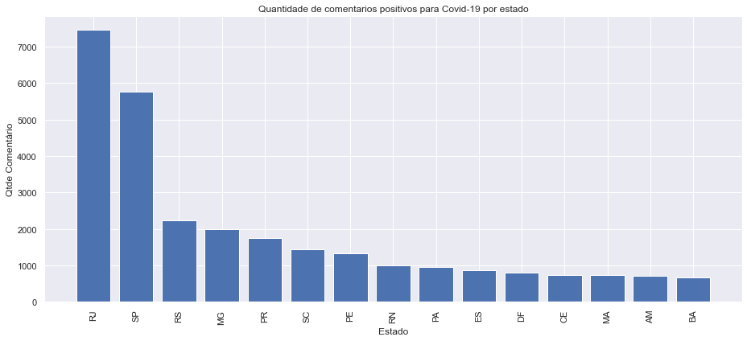
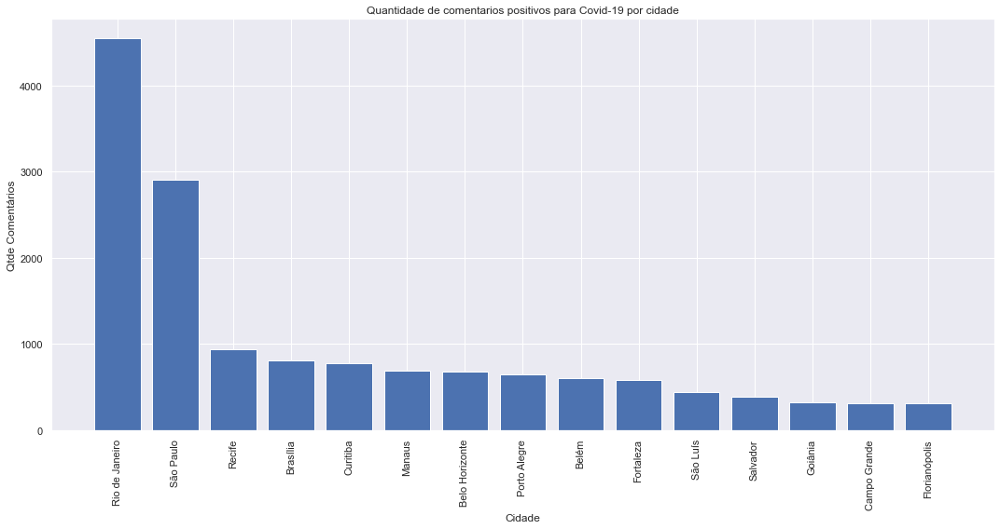
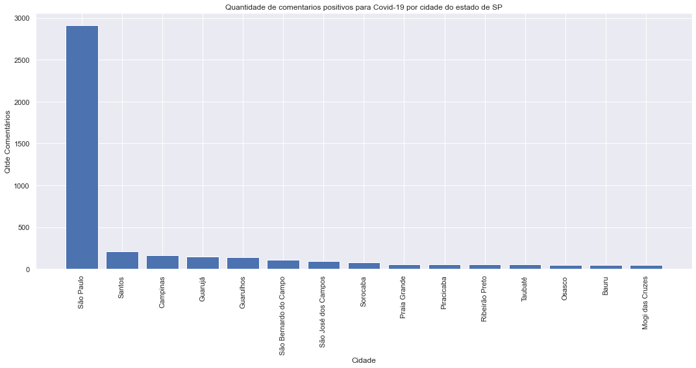
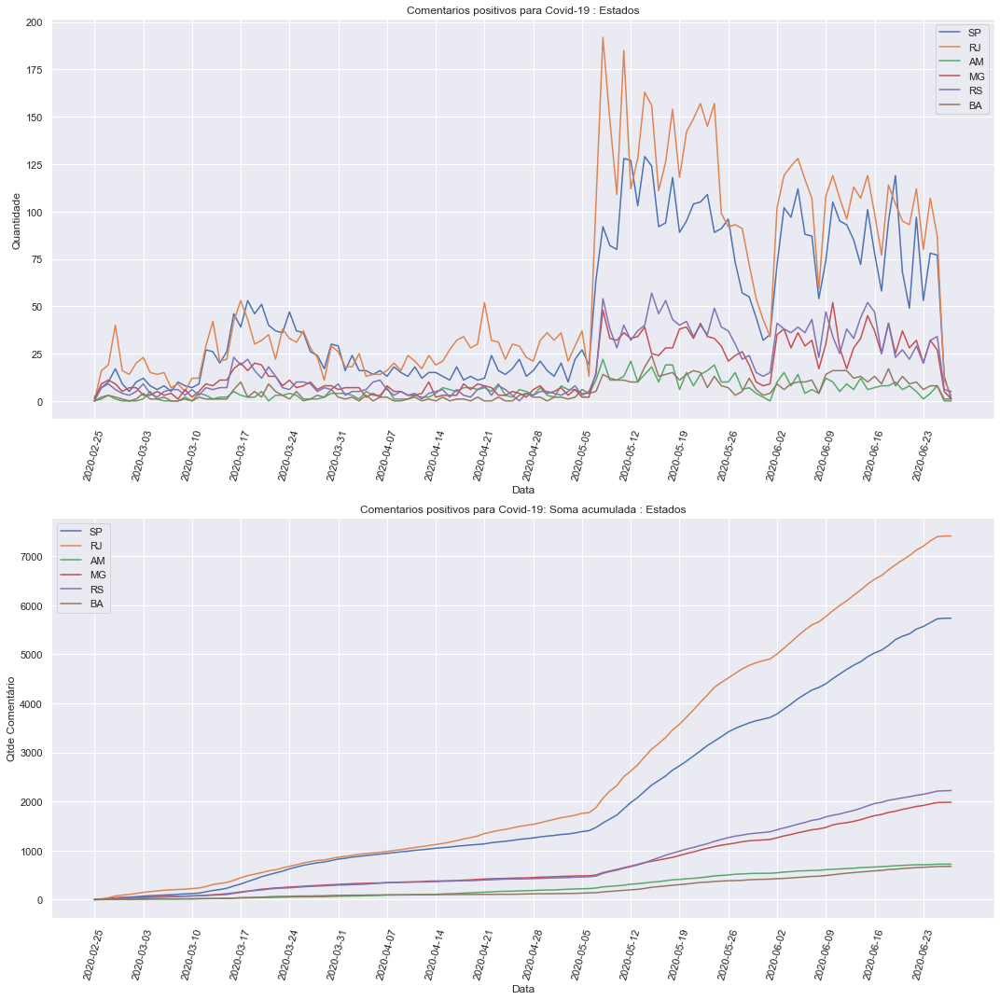

Importar dados do desenvolvimento da doença.

Importanto os dados da base de dados.

## Informações da base de dados

    Qtde. de Comentários               : 384281
    Qtde. de Comentários positivos     : 125135, 33%
    Qtde. de Comentários negativos     : 259146, 67%
    Qtde. de Comentários geolocalizados: 122268, 32%
    --------------------------------------------------
    Qtde. de Usuários geolocalizados   : 88039
    Qtde. de Usuários em SP            : 17349, 20%
    Qtde. de Usuários em RJ            : 18145, 21%
    Qtde. de Usuários em MG            : 6289, 7%
    Qtde. de Usuários em BA            : 2289, 3%
    Qtde. de Usuários em AM            : 1759, 2%

Exemplos de comentários com suas classificações:

    Classificação|Comentário
    negativo : RT @joicehasselmann: Amigos, comunico que fui diagnosticada com a COVID-19. Depois de crises de tosse, febre e falta de ar fui internada p/…
    ----------
    positivo : Em resposta a  @nilmoretto Não...estou há dias em isolamento esperando o resultado do teste,estou com pneumonia,tenho certeza de que não é covid,mas melhor prevenir ...enlouquecendo no quarto!!!!
    ----------
    negativo : Em resposta a  @K13PT Kkkkk mesmo quando virou febre nunca comi não.
    ----------
    negativo : Nossa, ontem eu chorei tanto pela minha mãe, mas hj já estou mais tranquilo, sabendo q ela n tá com COVID... Amém? Amém!
    ----------
    negativo : To querendo fica com febre
    ----------
    negativo : sonhei que eu tava com falta de ar ai desmaiei   grande dia
    ----------
    negativo : off: acho que peguei corona e já me curei De  Esquizopoc #VidasNegrasImportam
    ----------
    positivo : Meu deus a vic acha que eu to com corona por estar com dor de garganta
    ----------
    positivo : Não aguento mais essa dor no corpo e febre, sinceramente
    ----------
    positivo : Que dor de garganta
    ----------

## Nuvens de palavras

Nuvem de palavras de todos os comentários na base de dados.

Nuvens de palavras apenas de comentários classificados como positivos.

## Visualizações dos dados

